= GRAPHS (GRAFLAR)
:toc:

== Graf Nedir?

Graf, *doğrusal olmayan bir veri yapısıdır*. Bir graf, iki veya daha fazla köşeyi birbirine bağlayan *köşeler* ve *kenarlar* olarak da adlandırılan düğüm koleksiyonu olarak tanımlanabilir.

Bir graf, köşe noktalarının ebeveyn-çocuk ilişkisine sahip olmadığı, ancak aralarında karmaşık bir ilişki sürdürdüğü döngüsel bir ağaç olarak da görülebilir.

*Aşağıda graf veri yapısına bir örnek verilmiştir.*

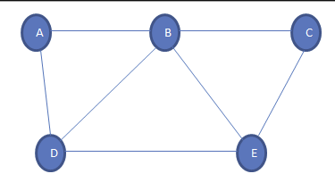

Yukarıda verilen bir graf örneğidir. Graf, bir  {A, B, C, D, E} köşesi ve kenarlardan ({(A, B), (B, C), (A, D)), (D, E), (E, C), (B, E), (B, D)} oluşur.

== Graf Türleri 

=== Yönlü ve Yönlendirilmemiş Graf

Kenarların yön içermediği bir grafa *yönlendirilmemiş graf* denir. Yukarıda gösterilen graf yönlendirilmemiş bir graftır.

Kenarların kendileriyle ilişkili yönlere sahip olduğu grafa *yönlendirilmiş graf* denir.

*Aşağıda, yönlendirilmiş graf örneği verilmiştir.*

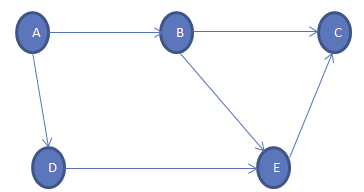

Yukarıda gösterilen yönlendirilmiş grafta kenarlar, her kenarın bir tepe noktasından başka bir tepe noktasına belirli bir yolu temsil ettiği sıralı bir çift oluşturur. Yolun başladığı tepe noktasına *Başlangıç Düğümü*, yolun sona erdiği tepe noktasına *Terminal Düğümü* denir .

Dolayısıyla yukarıdaki grafta, köşe kümesi {A, B, C, D, E} ve kenar kümesi {(A, B), (A, D), (B, C), (B, E ), (D, E) (E,)}.

== Graf Terminolojisi

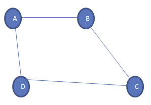

*1-Köşe noktası:* Grafın her düğümüne tepe noktası denir. Yukarıdaki grafta A, B, C ve D grafın köşe noktalarıdır.

*2-Kenar:* İki köşe arasındaki bağlantıya veya yola kenar denir. İki veya daha fazla köşeyi birbirine bağlar. Yukarıdaki grafta farklı kenarlar AB, BC, AD ve DC'dir.

*3-Bitişik düğüm:* Bir grafta, bir kenarla iki düğüm bağlanırsa, bunlara *bitişik düğümler* veya *komşular* denir. Yukarıdaki grafta A ve B köşeleri AB kenarı ile birleştirilmiştir. Böylece A ve B bitişik düğümlerdir.

*4-Düğüm derecesi:* Belirli bir düğüme bağlanan kenar sayısına düğümün derecesi denir. Yukarıdaki grafta A düğümü 2 derecesine sahiptir.

*5-Yol:* Bir grafta bir tepe noktasından diğerine gitmemiz gerektiğinde takip etmemiz gereken düğüm sırasına yol denir. Örnekteki grafta, A düğümünden C düğümüne gitmemiz gerekiyorsa, yol A-> B-> C olacaktır.

*6-Kapalı yol:* İlk düğüm bir terminal düğümü ile aynıysa, bu yol kapalı yol olarak adlandırılır.

*7-Basit yol:* Diğer tüm düğümlerin farklı olduğu kapalı bir yola basit yol denir.

*8-Döngü:* Tekrarlanan kenarlar veya köşeler olmayan ve ilk ve son köşelerin aynı olduğu yola döngü denir. Yukarıdaki grafta A-> B-> C-> D-> A bir döngüdür.

*9-Bağlı Graf:* Bağlı graf, köşelerin her biri arasında bir yol bulunan graftır. Bu, izole edilen veya bağlantı kenarı olmayan tek bir tepe noktasının olmadığı anlamına gelir. Yukarıda gösterilen graf bağlı bir graftır.

*10-Tam Graf:*  Her bir düğümün diğerine bağlandığı grafa *Tam graf* denir. N, bir grafta toplam düğüm sayısı ise, grafın tamamı *N (N-1) / 2* kenar sayısı içerir.

*11-Ağırlıklı Graf:* Her bir kenara, uzunluğunu (bir kenara bağlı köşeler arasındaki mesafe) belirten pozitif bir değere ağırlık denir. Ağırlıklı kenarlar içeren grafa *ağırlıklı graf* denir. Bir kenarın e ağırlığı w (e) ile gösterilir ve bir kenarın hareket etme maliyetini gösterir.

*12-Diyagram:* Diyagram , her kenarın belirli bir yöne bağlı olduğu ve *geçişin yalnızca belirtilen yönde* yapılabildiği bir graftır.

== Graf Gösterimi

Graf veri yapısının hafızada saklanma şekline *representation(temsil)* denir. Graf, sıralı gösterim veya bağlı gösterim olarak saklanabilir.

Bu iki tip de aşağıda açıklanmaktadır.

=== Sıralı Gösterim

Grafların ardışık sunumunda, bitişiklik matrisini kullanırız. Bir bitişiklik matrisi, *nxn boyutunda* bir matristir; burada *n, graftaki köşe sayısıdır.*

Bitişiklik matrisinin satırları ve sütunları, graftaki köşeler temsil eder. Köşeler arasında bir kenar olduğunda matris elemanı 1 olarak ayarlanır. Kenar yoksa, eleman 0 olarak ayarlanır.

*Aşağıda, bitişiklik matrisini gösteren bir örnek graf verilmiştir.*

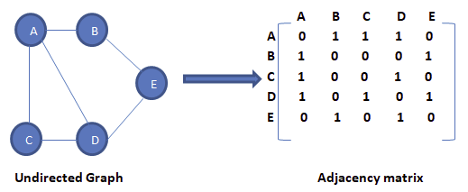

Yukarıdaki graf için bitişiklik matrisini gördük. Bu yönlendirilmemiş bir graf olduğundan ve kenarın her iki yönde de mevcut olduğunu söyleyebiliriz. Örneğin, AB kenarı mevcut olduğu için, BA kenarı da mevcut olduğu sonucuna varabiliriz.

Bitişiklik matrisinde, kenar mevcut olduğunda 1 olarak ve kenar olmadığında 0 olarak ayarlanmış matris öğeleri olan köşelerin etkileşimlerini görebiliriz.

Şimdi yönlendirilmiş bir grafın bitişiklik matrisini görelim.

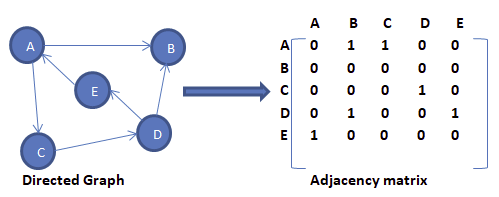

Yukarıda gösterildiği gibi, bitişiklik matrisindeki kesişim elemanı sadece ve yalnızca bir tepe noktasından diğerine yönlendirilmiş bir kenar varsa 1 olacaktır.

Yukarıdaki grafta A köşesinden iki kenara sahibiz. Bir kenar B köşesine, ikincisi C köşesine bitiyor. Böylece bitişiklik matrisinde A & B kesişimi A & C kesişimi olarak 1'e ayarlandı.

Ardından, ağırlıklı graf için sıralı temsili göreceğiz.

Aşağıda ağırlıklı graf ve karşılık gelen bitişiklik matrisi verilmiştir.

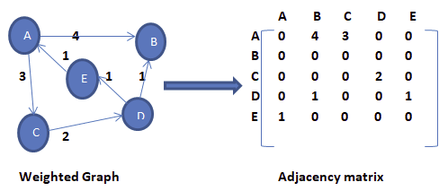

Ağırlıklı bir grafın ardışık sunumunun diğer graf türlerinden farklı olduğunu görebiliriz. Burada, bitişiklik matrisindeki sıfır olmayan değerler, kenarın gerçek ağırlığı ile değiştirilir.

AB kenarı ağırlık = 4'e sahiptir, bu nedenle bitişiklik matrisinde A ve B'nin kesişimini 4'e ayarladık. Benzer şekilde, diğer tüm sıfır olmayan değerler ilgili ağırlıklarına değiştirilir.

Bitişik listenin uygulanması ve takibi daha kolaydır. Geçiş yani bir tepe noktasından diğerine bir kenar olup olmadığını kontrol etmek O (1) zaman alır ve bir kenarı çıkarmak da O (1) alır.

=== Bağlı Gösterim

Bitişik listesini grafın bağlı liste gösterimi için kullanırız. Bitişik liste, grafın her bir düğümünü ve bu düğüme bitişik düğümlerin bağlantısını korur. Tüm bitişik düğümleri geçtiğimizde, bir sonraki işaretçiyi listenin sonunda null değerine ayarladık.

*Önce yönlendirilmemiş bir grafı ve bitişik listesini ele alalım.*

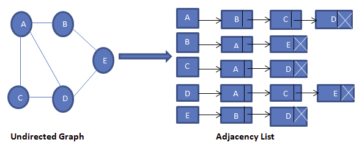

Yukarıda gösterildiği gibi, her bir düğüm için bağlı listemiz (bitişiklik listesi) var. Köşe A'dan kenarlara, B, C ve D köşelerine kadar var. Bu nedenle bu düğümler, karşılık gelen bitişiklik listesindeki A düğümüne bağlanır.

*Ardından, yönlendirilen graf için bir bitişik liste oluştururuz.*

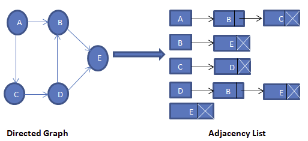

Yukarıda yönlendirilen grafta, köşe E'den kaynaklanan hiçbir kenar olmadığını görüyoruz. Dolayısıyla köşe E için bitişik liste boştur.

Şimdi ağırlıklı graf için bitişik listesini oluşturalım.

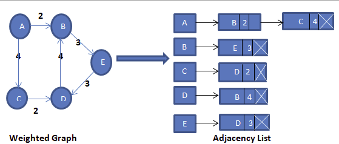

Ağırlıklı graf için, yukarıda gösterildiği gibi kenarın ağırlığını belirtmek için bitişiklik listesi düğümüne fazladan bir alan ekliyoruz.

Bitişiklik listesine köşe noktası eklemek daha kolaydır. Bağlı liste uygulaması sayesinde alandan da tasarruf sağlar. Bir tepe ile diğeri arasında bir kenar olup olmadığını bulmamız gerektiğinde, işlem verimli değildir.

== Örneğin ==

**Graf oluşturma**

[source,c++]
----
#include <iostream>
using namespace std;
 
//Graf oluşturma...
 
//bağlı liste elemanları tutar
struct adjNode {
    int val, cost;
    adjNode* next;
};
 
//kenarları saklamak için oluşturulan struct
struct graphEdge {
    int start_ver, end_ver, weight;
};
 
class DiaGraph{
    //verilen graftaki bağlı listesine yeni düğümler ekle
    adjNode* getAdjListNode(int value, int weight, adjNode* head)   {
        adjNode* newNode = new adjNode;
        newNode->val = value;
        newNode->cost = weight;
 
        newNode->next = head;  //yeni düğümü geçerli başlığa yönlendir
        return newNode;
    }
    int dugumSayisi;  //graftaki düğüm sayısı
public:
    adjNode **head;  //işaretçi dizisi olarak bağlı liste
 
    DiaGraph(graphEdge kenarlar[], int kenarSayisi, int dugumSayisi)  { //constructor
 
        head = new adjNode*[dugumSayisi]();//yeni düğüm ekler
        this->dugumSayisi = dugumSayisi;
 
        for (int i = 0; i < dugumSayisi; ++i)//tüm köşeler için head işaretçisini başlatır
            head[i] = nullptr;
 
        //kenarları ekleyerek yönlendirilmiş graf oluşturma
        for (unsigned i = 0; i < kenarSayisi; i++)  {
            int start_ver = kenarlar[i].start_ver;
            int end_ver = kenarlar[i].end_ver;
            int weight = kenarlar[i].weight;
 
            //başlangıçta ekler
            adjNode* newNode = getAdjListNode(end_ver, weight, head[start_ver]);
 
            head[start_ver] = newNode;//yeni düğüme head işaretçisini atar
        }
    }
 
    ~DiaGraph() {// destructor(yıkıcı)
        for (int i = 0; i < dugumSayisi; i++)
            delete[] head[i];
        delete[] head;
    }
};
// verilen tepe noktasının tüm bitişik köşelerini yazdır
void display_AdjList(adjNode* ptr, int i)
{
    while (ptr != nullptr) {
        cout << "(" << i << ", " << ptr->val
             << ", " << ptr->cost << ") ";
        ptr = ptr->next;
    }
    cout << endl;
}
 
int main()
{
    // graf kenarlar dizisi
    graphEdge kenarlar[] = {
            // (x, y, w) -> edge from x to y with weight w
            {0,1,2},{0,2,4},{1,4,3},{2,3,2},{3,1,4},{4,3,3}
    };
    int dugumSayisi = 6;//graftaki köşe noktası(dugum) sayısı
 
    int kenarSayisi = sizeof(kenarlar)/sizeof(kenarlar[0]);//graftaki kenar sayısını hesaplar
 
    DiaGraph diagraph(kenarlar, kenarSayisi, dugumSayisi);//graf oluşturur
 
    cout<<"(start_vertex, end_vertex, weight):"<<endl;
    for (int i = 0; i < dugumSayisi; i++)//bitişik liste grafının gösterimi
    {
        //komşu köşeleri gösterir
        display_AdjList(diagraph.head[i], i);
    }
    return 0;
}
----

Ekran Çıktısı:

 (start_vertex, end_vertex, weight):
 (0, 2, 4) (0, 1, 2) 
 (1, 4, 3) 
 (2, 3, 2) 
 (3, 1, 4) 
 (4, 3, 3) 
 

== Örneğin
 
*STL kullanarak graf uygulaması*

[source,c++]
----
#include <iostream>
#include <vector>
using namespace std;
 
//STL kullanarak graf uygulaması
 
//graf kenarlarını depolamak için struct
struct Edge {
    int src, dest;
};
 
//graf nesnesini temsil eden sınıf
class Graph
{
public:
    // bitişiklik listesini temsil etmek için bir vektör
    vector<vector<int>> adjList;
 
    Graph(vector<Edge> const &kenarlar, int dugumSayisi)//constructor
    {
        // vektör türünü N öğelerine yeniden boyutlandırma vector < int>
        adjList.resize(dugumSayisi);
 
        // yönlendirilmiş grafa kenarlar ekleme
        for (auto &kenar: kenarlar)
        {
            adjList[kenar.src].push_back(kenar.dest);//push_back() fonksiyonu ile yönlendirilmiş grafın sonuna ekler
 
            // adjList[kenar.dest].push_back(kenar.src);//yönlendirilmemiş grafın sonuna ekler
        }
    }
};
 
// grafı yazdıran fonksiyon
void printGraph(Graph const& graph, int dugumSayisi)
{
    for (int i = 0; i < dugumSayisi; i++)
    {
        cout << i << " --> ";//köşe numarasını yazdırır
 
        for (int j : graph.adjList[i])//vertex'in tüm komşu köşelerini yazdırır
            cout << j << " ";
        cout << endl;
    }
}
 
int main()
{
    //graf kenarlarını gösteren vektör
    vector<Edge> kenarlar =
            {
                    { 0, 1 }, { 1, 2 }, { 2, 0 }, { 2, 1 },
                    { 3, 2 }, { 4, 5 }, { 5, 4 }
            };
 
    int dugumSayisi = 6;//graftaki düğüm sayısı
 
    Graph graph(kenarlar, dugumSayisi);//graf oluşturur
 
    printGraph(graph, dugumSayisi);//grafı yazdırır
 
    return 0;
}
----

Ekran Çıktısı:

 0 --> 1 
 1 --> 2 
 2 --> 0 1 
 3 --> 2 
 4 --> 5 
 5 --> 4 

== Grafların Renklendirilmesi

Graf renklendirme, graf üzerinde birbirine komşu olan düğümlere farklı renk atama işlemidir; amaç, en az sayıda renk kullanılarak tüm düğümlere komşularından farklı birer renk vermektir. Renklendirmede kullanılan toplam renk sayısı kromatik (chromatik) sayı olarak adlandırılır.

Uygulamada, graf renklendirmenin kullanılacağı alanların başında, ilk akla gelen, harita üzerindeki bölgelerin renklendirilmesi olmasına karşın, graf renklendirme bilgisayar biliminde ve günlük yaşamdaki birçok problemin çözümüne ciddi bir yaklaşımdır. 

=== Kromatik Sayı
Kromatik sayı, bir grafı renklendirmek için gereken minimum renk sayısıdır. Örneğin, aşağıdaki grafın kromatik sayısı 3'tür.

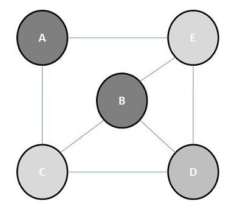

Graf renklendirmede kullanılan algoritmaların
başında *Welch ve Powel* algoritmasıdır.

=== Welch ve Powel Algoritması

* Düğümler derecelerine göre büyükten küçüğe doğru
sıralanır.
* İlk renk birinci sıradaki düğüme atanır ve daha sonra aynı renk bitişik olamayacak şekilde diğer düğümlere
verilir.
* Bir sonraki renge geçilir ve aynı işlem düğümlerin tamamı renklendirilinceye kadar devam ettirilir.

==== Örneğin;

En az renk kullanılarak düğümleri
renklendiriniz.

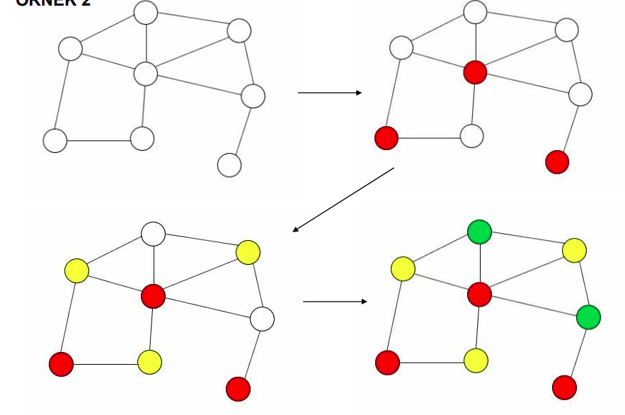

==== Örneğin:

En az renk kullanılarak düğümleri
renklendiriniz. Kromatik sayı kaç olur?

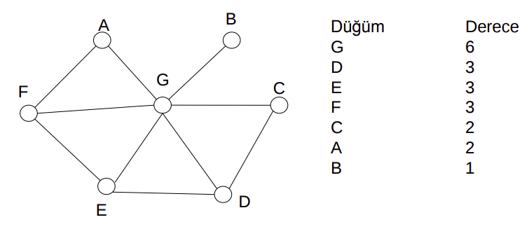

Çözüm:

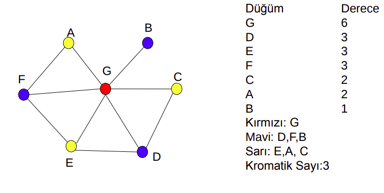

== Graf Üzerinde Dolaşma

1. DFS(Depth First Search)
2. BFS(BreadthFirstSearch)

=== DFS(Depth First Search)

Graf üzerinde dolaşma yöntemlerinden birisidir; önce derinlik araması olarak adlandırılabilir; başlangıç düğümünün bir kenarından başlayıp o kenar üzerinden gidilebilecek en uzak (derin) düğüme kadar sürdürülür.

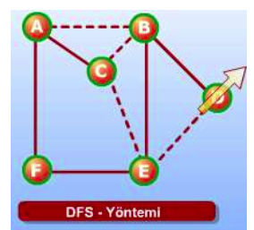

=== Örneğin
*DFS ile graf üzerinde dolaşma*

[source,c++]
----
#include <iostream>
#include <vector>
 
using namespace std;
 
class Graph{
    int dugum; //köşe sayısı
 
    //bitişik listeler içeren bir vektörün işaretçisi
    vector < int > *adj;
public:
    Graph(int dugumSayisi); //constructor
 
    void kenarEkle(int dugumSayisi, int eleman);//grafa kenar ekleme fonksiyonu
 
    void dfs();
    void dfs_util(int s, vector < bool> &visited);
};
 
Graph::Graph(int dugum){
    this -> dugum = dugum;
    adj = new vector < int >[dugum];
}
 
void Graph::kenarEkle(int dugum, int eleman){
    adj[dugum].push_back(eleman); //listeye elemanı'yi ekler
    adj[eleman].push_back(eleman);  //dugumSayisini eleman listesine ekler (graf yönlendirilmişse bu ifadeyi kullanılmaz!)
}
void Graph::dfs(){
    //düğümleri işaretlemek için vector
    vector < bool > visited(dugum, false);  //tüm düğümleri / köşeleri ziyaret edilmemiş olarak işaretleme
    for(int i = 0; i < dugum; i++)
        if(!visited[i])
            dfs_util(i, visited);
}
// referans ile dugumler çagirilir
void Graph::dfs_util(int s, vector < bool > &visited){
    //ziyaret edilen düğüm/köşe işaretlenir
    visited[s] = true;
    cout << s << " ";//yazdırılır
 
    /* traverse its adjacency list and recursively call dfs_util for all of its neighbours!
    bitişiklik listesini dolaşır ve yinelemeli komşusu için dfs_util aranır*/
    for(vector < int > :: iterator itr = adj[s].begin(); itr != adj[s].end(); itr++)
        if(!visited[*itr])
            dfs_util(*itr, visited);
}
 
int main()
{
    //Graph sınıfı kullanılarak graf olusturulur
    Graph graf(4);
    graf.kenarEkle(0, 1);
    graf.kenarEkle(0, 2);
    graf.kenarEkle(1, 2);
    graf.kenarEkle(2, 0);
    graf.kenarEkle(2, 3);
    graf.kenarEkle(3, 3);
 
    graf.dfs(); // 0 1 2 3
 
    return 0;
}
----

Ekran Çıktısı:

 0 1 2 3 

 

=== BFS(BreadthFirstSearch)

Genişlik araması olarak adlandırılabilir. Bu yöntemin DFS'den farkı, dolaşmaya, başlangıç düğümünün bir kenarı ayrıtı üzerinden en uzağa gidilmesiyle değilde, başlangıç düğümünden gidilebilecek tüm komşu düğümlere gidilmesiyle başlanır (en kısa yol algoritmasıdır).

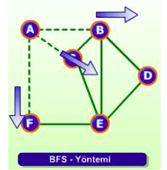

=== Örneğin

*BFS ile graf üzerinde dolaşma*

[source,c++]
----
#include<iostream>
#include <list>
 
//Belirli bir kaynak köşesinden bfs geçişi yazdırmak için program. BFS (int s), s'den erişilebilen köşeleri geçer.
 
using namespace std;
 
//Graph sınıfı, bitişik liste gösterimini kullanarak yönlendirilmiş bir grafı temsil eder
class Graph
{
    int koseler;  //koseler
 
    // Pointer to an array containing adjacency
    // lists
    list<int> *adj;
public:
    Graph(int V); //constructor
 
    //grafa bir kenar eklemek için fonksiyon
    void kenarEkle(int dugum, int eleman);
 
    //belirli bir kaynaktan bfs geçişi yazdırır
    void BFS(int s);
};
 
Graph::Graph(int koseler)
{
    this->koseler = koseler;
    adj = new list<int>[koseler];
}
 
void Graph::kenarEkle(int dugum, int eleman){
 
    adj[dugum].push_back(eleman); //düğüme eleman ekler
}
 
void Graph::BFS(int s)
{
    bool *visited = new bool[koseler];// ziyaret edilmeyen tüm köşeleri işaretler
    for(int i = 0; i < koseler; i++)
        visited[i] = false;
 
    list<int> queue; //bfs için bir queue oluşturma
 
 
    visited[s] = true;//geçerli düğümü ziyaret edilmiş olarak işaretler
    queue.push_back(s);
 
    list<int>::iterator i;//i: bir köşenin tüm bitişik köşelerini elde etmek için kullanılacaktır
 
 
    while(!queue.empty())
    {
        s = queue.front();//kuyruğa köşeyi(düğümü) ekler
        cout << s << " ";
        queue.pop_front();
 
        //dequeued vertex s'nin tüm bitişik köşelerini alır. ziyaret edilen düğümleri işaretler ve enqueue yapar
        for (i = adj[s].begin(); i != adj[s].end(); ++i)
        {
            if (!visited[*i])
            {
                visited[*i] = true;
                queue.push_back(*i);
            }
        }
    }
}
 
int main()
{
    //Graph sıınıfından graf oluşturur
    Graph graf(4);
    graf.kenarEkle(0, 1);
    graf.kenarEkle(0, 2);
    graf.kenarEkle(1, 2);
    graf.kenarEkle(2, 0);
    graf.kenarEkle(2, 3);
    graf.kenarEkle(3, 3);
 
    graf.BFS(2);
 
    return 0;
}
----

Ekran Çıktısı:

 2 0 3 1 

 

== Graf Algoritmaları

En küçük yol ağacını belirlemek için birçok algoritma geliştirilmiştir.

*Kruskal Algoritması:* Daha az maliyetli kenarları tek tek değerlendirerek yol ağacını bulmaya çalışır. Ara işlemler birden çok ağaç
oluşturabilir.

*Prim Algoritması:* En az maliyetli kenardan başlayıp onun uçlarından en az maliyetle genişleyecek kenarın seçilmesine dayanır. Bir tane ağaç oluşur.

*Sollin Algoritması:* Doğrudan paralel programlamaya yatkındır. Aynı
anda birden çok ağaçla başlanır ve ilerleyen adımlarda ağaçlar birleşerek
tek bir yol ağacına dönüşür.

*Dijkstra Algoritması:*

* Ağırlıklı ve yönlü graflar için geliştirilmiştir.
* Graf üzerindeki kenarların ağırlıkları 0 veya sıfırdan büyük sayılar
olmalıdır.
* Negatif ağırlıklar için çalışmaz.

*Bellman ve Ford Algoritması:*  Negatif ağırlıklı graflar için geliştirilmiştir.

*Floyd Algoritması:*

=== Dijkstra Algoritması

1. Başlangıç olarak sadece başlangıç düğümünün en
kısa yolu bilinir. (0 dır.)
2.  Tüm düğümlerin maliyeti bilinene kadar devam et.
* O anki bilinen düğümler içerisinden en iyi düğümü
şeç. (en az maliyetli düğümü seç, daha sonra bu
düğümü bilinen düğümler kümesine ekle)
* Seçilen düğümün komşularının maliyetlerini
güncelle

=== Dijkstra Algoritması ile Verilen Bir Kök Düğüm için En Az Maliyetli Yol Ağacının Bulunması

=== Örneğin

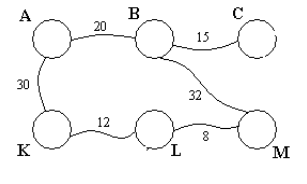
Yukarıdaki grafta A kök düğümü için en az maliyetli (en kısa) yol ağacını bulunuz.

6 düğümden oluşan bir maliyetli graf

1) En küçük değer B düğümüne ait 

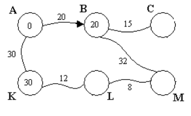

2) En küçük değere sahip olan düğüm K

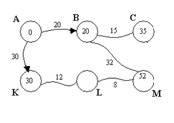

3) En küçük değer C düğümüne ait

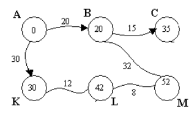

4) Son iki düğümden küçük olanı L

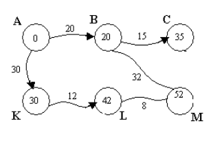

5) M düğümünün en düşük maliyeti

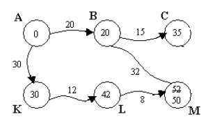

6) A kök düğümü için elde edilen
en kısa (optimum) yol ağacı

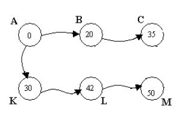

=== Örneğin

*Dijkstra en kısa yol algoritması*

[source,c++]
----
#include <iostream>
#include <limits.h>
#include <stdio.h>
 
#define dugum 9 //graftaki köşe(dugum) sayısı
 
using namespace std;
//Dijkstra en kısa yol algoritması
 
//en kısa yol ağacına henüz dahil olmayan köşe kümesinden minimum mesafe değerine sahip köşe noktasını bulmak için fonksiyon
int minDistance(int dist[], bool sptSet[])
{
    // minimum değeri başlatır
    int min = INT_MAX, min_index;
 
    for (int v = 0; v < dugum; v++)
        if (sptSet[v] == false && dist[v] <= min)
            min = dist[v], min_index = v;
 
    return min_index;
}
 
//oluşturulan minDistance dizisini yazdırmak fonksiyon
int printSolution(int dist[])
{
    cout<<"Köşe \t Kaynağa olan uzaklık\n"<<endl;
    for (int i = 0; i < dugum; i++)
        cout<<i<<"\t\t"<<dist[i]<<endl;
}
 
//bitişik matris gösterimi kullanılarak temsil edilen bir graf için Dijkstra'nın tek kaynaklı en kısa yol algoritmasını uygulayan fonksiyon
void dijkstra(int graph[dugum][dugum], int src)
{
    int dist[dugum]; //dist [i] en kısa yolu tutar
 
    bool sptSet[dugum]; // sptSet[i] vertex i en kısa sürede dahil edilirse doğru olacaktır
    // yol ağacı veya src'den i'ye en kısa mesafe
 
    // tüm mesafeleri sonsuz olarak başlat ve sptSet[]'i false olarak ayarla
    for (int i = 0; i < dugum; i++)
        dist[i] = INT_MAX, sptSet[i] = false;
 
    // kaynak tepe noktasının kendisinden uzaklığı her zaman 0'dır
    dist[src] = 0;
 
    // tüm düğümler için en kısa yolu bulun
    for (int count = 0; count < dugum - 1; count++) {
       //henüz işlenmemiş düğümlerin kümesinden minimum mesafe köşesini seçer.
       //u her zaman ilk yinelemede src eşittir.
        int u = minDistance(dist, sptSet);
 
        //seçilen düğümü işaretler
        sptSet[u] = true;
 
        //seçilen köşenin bitişik köşelerinin dist değerini günceller
        for (int v = 0; v < dugum; v++)
 
            /*update dist [v] sadece sptset'te değilse, u'dan V'ye bir kenar vardır ve src'den V'ye u'ya giden yolun
            toplam ağırlığı, dist[v] ' nin geçerli değerinden daha küçüktür]*/
            if (!sptSet[v] && graph[u][v] && dist[u] != INT_MAX
 
                && dist[u] + graph[u][v] < dist[v])
                dist[v] = dist[u] + graph[u][v];
    }
 
    // oluşturulan dist dizisini yazdırır
    printSolution(dist);
}
 
int main()
{
    // graf oluşturulur
    int graph[dugum][dugum] = { { 0, 4, 0, 0, 0, 0, 0, 8, 0 },
                        { 4, 0, 8, 0, 0, 0, 0, 11, 0 },
                        { 0, 8, 0, 7, 0, 4, 0, 0, 2 },
                        { 0, 0, 7, 0, 9, 14, 0, 0, 0 },
                        { 0, 0, 0, 9, 0, 10, 0, 0, 0 },
                        { 0, 0, 4, 14, 10, 0, 2, 0, 0 },
                        { 0, 0, 0, 0, 0, 2, 0, 1, 6 },
                        { 8, 11, 0, 0, 0, 0, 1, 0, 7 },
                        { 0, 0, 2, 0, 0, 0, 6, 7, 0 } };
 
    dijkstra(graph, 0);
 
    return 0;
}
----

Ekran Çıktısı:

=== Bellman-Ford Algoritması

Algoritma Richard Bellman ve Lester Ford, Jr. tarafından geliştirilmiştir. Bellman-Ford Algoritması, yönlü graflarda tek bir kök düğüm için en az maliyetli yolu hesaplamak için kullanılır. Dijkstra Algoritması daha kısa sürede aynı problemi çözebilir ancak negatif ağırlıklı hatlar varsa bize doğru sonucu döndürmez. Bu nedenle negatif ağırlıklı hatlar söz konusu olduğunda Bellman-Ford algoritması kullanılır. 

Bellman-Ford Algoritması bir kök düğüm için en az maliyetli yol ağacını bulmakta
kullanılır. Çalışma zamanı *O(n*m)* olarak ifade edilir. Ancak bütün düğümler için en
kısa yollar bulunması gerektiğinde Floyd-Warshall Algoritmasının kullanılması tavsiye
edilir. Negatif ağırlıklı hatlar bazen negatif maliyetli döngülere neden olmaktadır. Bu
durumlarda Bellman-Ford algoritması istenen problemi çözememekte ve false değeri
döndürerek negatif maliyetli döngünün (negative-cost cycles) varlığını haber
vermektedir. Şekil 2’de B,C,D,E düğümleri arasında bir negatif döngü oluştuğu için
shortest path bulunamaz. Ve Algoritma sonuç olarak en az maliyetli ağaç yerine false
değeri döndürür.

Bellman-Ford Algoritmasının çalışma adımları şu şekildedir:

* Bellman-Ford algoritmasının ilk adımında kök düğümüne 0 değeri atanırken diğer düğümler için maliyeti ∞ olarak belirlenir.

* Hatlar için belirli bir sıralama oluşturulur. Bu sıralamanın belli bir kuralı yoktur.

* Düğüm sayısı n ise en çok n-1 kez olacak şekilde her hat üzerinden maliyetlerdeki değişimler hesaplanır.

* Negatif ağırlıklı döngülerin varlığı kontrol edilir.

=== Örneğin

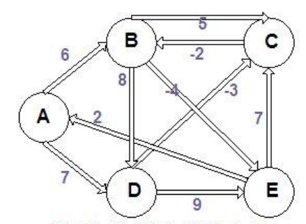

A düğümünü kök düğüm kabul ederek aşağıda verilen graf için en kısa dallanan ağacı bulalım.

1) Şekilde görüldüğü gibi A kök düğümüne 0 değeri atanırken diğer düğümler için maliyeti ∞ olarak belirlenir. Ve hatlar için rastgele bir sıralama yapılır.

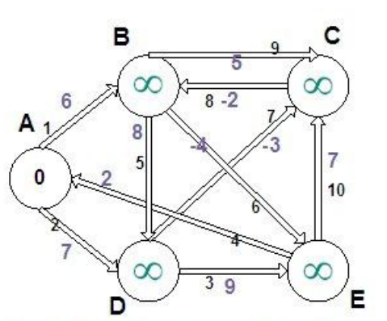
1. ve 2. hatlar için maliyet değişimleri

2) Hat sıralamasına göre maliyetler yenilenir. Sonsuz maliyetli düğümlerin maliyeti ancak daha
küçük bir değer hesaplanırsa güncelleme yapılır ve bir önceki (parent) düğümü saklanır.
1 numaralı hat için A kök düğümünün 0 olan maliyetine hattın maliyeti eklenir: 0+6=6. Çıkan 6
değeri sonsuzdan küçük olduğu için B düğümünün maliyeti yenilenir. Bir önceki (parent)
düğümün belirtilmesi için A düğümünü B düğümüne bağlayan 1 numaralı hat işaretlenir. Daha
sonra 2 numaralı hat için 0+7=7 küçüktür sonsuz eşitliğinden D düğümünün maliyeti
güncellenirken parent olarak olarak A düğümü gösterilir.

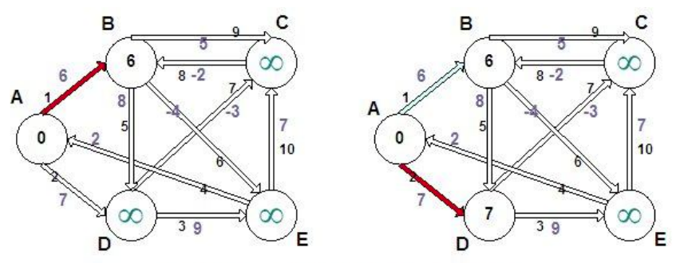

3-4. hatlar için maliyet değişimleri

3) 3 numaralı hat D düğümünü E düğümüne bağlamaktadır. Ve 7+9=16 maliyeti sonsuzdan küçük olduğu için E düğümünün maliyeti 16 olarak güncellenir. 3 nolu
hat parentın saklanması için işaretlenir. 4 nolu hat E düğümü ile A düğümü arasındadır ve maliyet hesabı yapıldığında 16+2=18 olur. 18 değeri 0 dan büyük olduğu için işlem yapılmaz bir sonraki hatta bakılır.

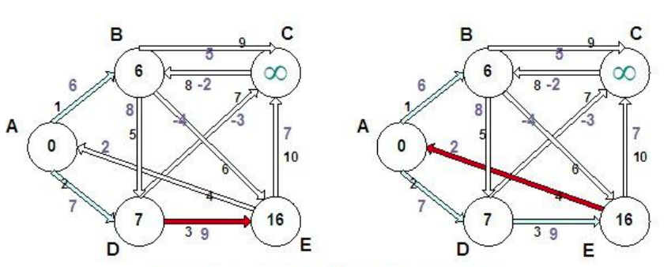
5-6. hatlar için maliyet değişimleri

4) Beşinci hat B ve D düğümlerini 8 maliyetle bağlamaktadır. 6+8=14 değeri 7'den
küçük olduğu için işlem yapılmaz ve 6 nolu hatta geçilir. 6 nolu hat B düğümünü -4
maliyetle E düğümüne bağlamakta olup 6+(-4)=2 değeri 16 değerinden küçük
olduğu için E düğümünün maliyeti yenilenir. Daha önce D düğümünü işaret eden
parent değeri temizlenerek parent olarak B düğümünü gösteren 6 nolu hat işaretlenir.

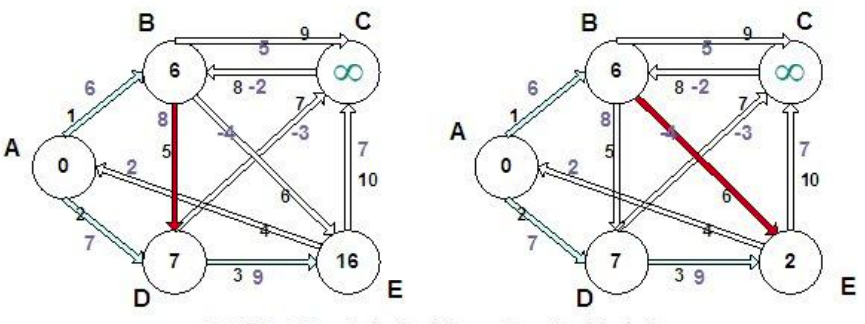
7-8. hatlar için maliyet değişimleri

5) 7 nolu hattı incelendiğinde, D düğümünün 7 olan maliyetine hattın değeri eklenirse
7+(-3)=4 sonsuzdan küçük olduğu görülmektedir. C düğümünün maliyet alanı
güncellenir ve parent düğüm olarak D olarak işaretlenir. Sıradaki hatta geçilir.
Burada oluşan 4+(-2)= 2 değeri B düğümünün maliyetinin güncellenmesine sebep
olur. Daha önce A olarak görünen parent düğümü de 8 nolu hattın işaretlenmesi ile C düğümü olarak değişir.

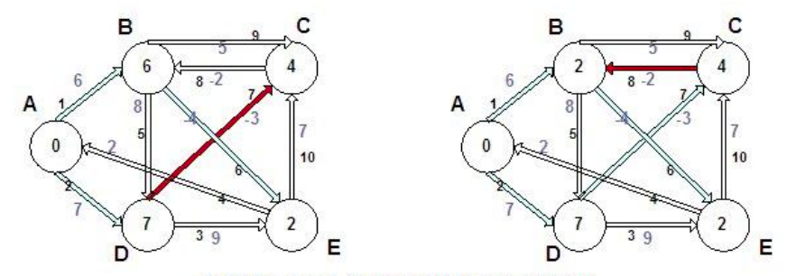
9-10. hatlar için maliyet değişimleri

6) 9 nolu hat incelenirse, B düğümünün 2 olan maliyetine hattın değeri eklendiğinde
2+5=7 değerini elde edilir. 7 değeri 4’den küçük olmadığı için güncelleme yapılmaz ve sıradaki hatta geçilir. 10 numaralı hat ise E düğümünü C düğümüne
bağlamaktadır: 2+10=12. C düğümünün maliyeti 4 den büyük olduğu için burada da bir işlem yapılmaz.

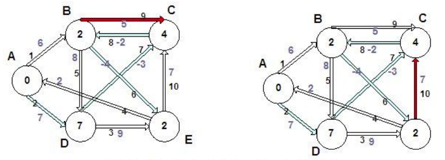

7) Bütün hatlar sırayla dolaşıldığı için birinci döngü biter ve sonuç şekildeki gibi bulunur.

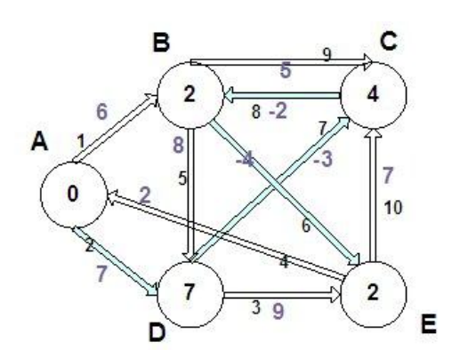

8) İkinci döngüde de birincide olduğu gibi bütün hatlar sırayla dolaşılır. Maliyet
daha küçük hesaplanırsa güncelleme yapılır ve parent düğümü saklanır aksi
durumda işlem yapılmaz. İlerleyen şekillerde (Şekil 3.8. - a, b, c, d ve e)
işlemler adım adım gösterilmiştir.

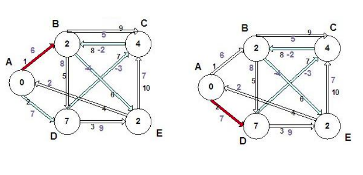

9) Adımlar:

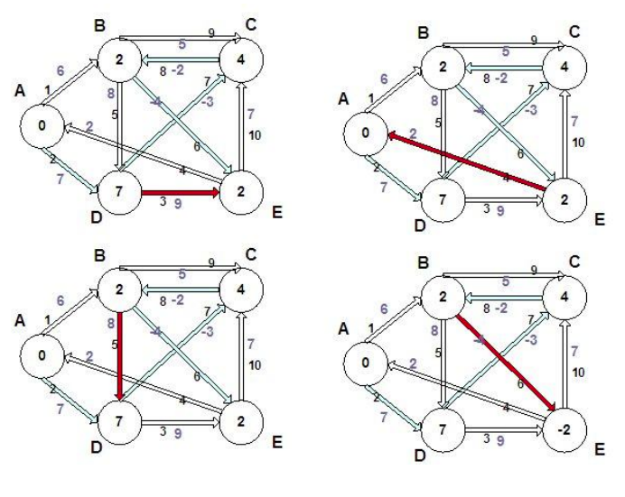

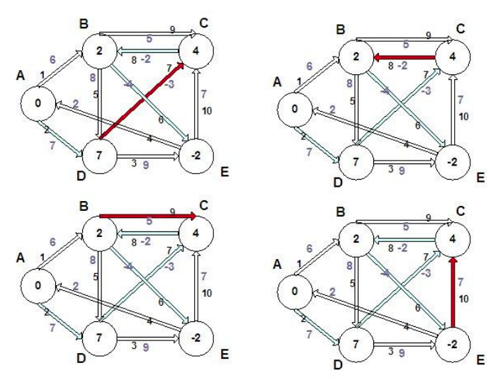

=== Örneğin

*Bellman-Ford algoritması ile en kısa yolu bulma..*

[source,c++]
----
#include <bits/stdc++.h>
#include <iostream>
 
using namespace std;
//Bellman-Ford ile en kısa yolu bulma...
 
// grafta kenarları gösteren struct
struct Edge {
    int src, dest, weight;
};
 
//bağlı, yönlendirilmiş ve ağırlıklı bir grafları gösteren struct
struct Graph {
 
   // V: köşe sayısı, E: kenar sayısı
    int V, E;
 
 
    struct Edge* edge;// grafı kenar dizisi olarak temsil eder
};
 
// V Köşeli ve E kenarlarlı olan bir graf oluşturur
struct Graph* createGraph(int V, int E)
{
    struct Graph* graph = new Graph;
    graph->V = V;
    graph->E = E;
    graph->edge = new Edge[E];
    return graph;
}
//oluşturulan grafı yazdırmak için fonksiyon
void printArr(int dist[], int n)
{
    cout<<"Köşe \t Kaynağa olan uzaklık\n";
    for (int i = 0; i < n; ++i)
        cout<<i<<"\t\t"<<dist[i]<<endl;
}
 
//Bellman-Ford algoritmasını kullanarak src'den diğer tüm köşelere en kısa mesafeleri bulan fonksiyon
void BellmanFord(struct Graph* graph, int src)
{
    int V = graph->V;
    int E = graph->E;
    int dist[V];
 
    // src'den diğer tüm köşelere sonsuz olarak mesafeleri başlatın
    for (int i = 0; i < V; i++)
        dist[i] = INT_MAX;
    dist[src] = 0;
 
    // src'den diğer herhangi bir köşeye basit bir en kısa yol en fazla |V|-1 kenarlara sahip olabilir
    for (int i = 1; i <= V - 1; i++) {
        for (int j = 0; j < E; j++) {
            int u = graph->edge[j].src;
            int v = graph->edge[j].dest;
            int weight = graph->edge[j].weight;
            if (dist[u] != INT_MAX && dist[u] + weight < dist[v])
                dist[v] = dist[u] + weight;
        }
    }
 
   //negatif ağırlık döngüler kontrol edilir. Yukarıda, graf negatif ağırlık döngüsü içermiyorsa en kısa mesafeleri garanti eder.
   // Daha kısa bir yol alırsak, o zaman bir döngü olur
    for (int i = 0; i < E; i++) {
        int u = graph->edge[i].src;
        int v = graph->edge[i].dest;
        int weight = graph->edge[i].weight;
        if (dist[u] != INT_MAX && dist[u] + weight < dist[v]) {
            printf("Graph contains negative weight cycle");
            return; //negatif döngü tespit edilirse, sadece return edilir
        }
    }
 
    printArr(dist, V);
 
    return;
}
 
int main()
{
    int V = 5; //graftaki köşe sayısı
    int E = 8; //graftaki kenar sayısı
    struct Graph* graph = createGraph(V, E);
 
    // 0-1 kenara düğüm eklenir
    graph->edge[0].src = 0;
    graph->edge[0].dest = 1;
    graph->edge[0].weight = -1;
 
    // 0-2 kenara düğüm eklenir
    graph->edge[1].src = 0;
    graph->edge[1].dest = 2;
    graph->edge[1].weight = 4;
 
    // 1-2 kenara düğüm eklenir
    graph->edge[2].src = 1;
    graph->edge[2].dest = 2;
    graph->edge[2].weight = 3;
 
    // 1-3 kenara düğüm eklenir
    graph->edge[3].src = 1;
    graph->edge[3].dest = 3;
    graph->edge[3].weight = 2;
 
    // 1-4 kenara düğüm eklenir
    graph->edge[4].src = 1;
    graph->edge[4].dest = 4;
    graph->edge[4].weight = 2;
 
    // 3-2 kenara düğüm eklenir
    graph->edge[5].src = 3;
    graph->edge[5].dest = 2;
    graph->edge[5].weight = 5;
 
    // 3-1 kenara düğüm eklenir
    graph->edge[6].src = 3;
    graph->edge[6].dest = 1;
    graph->edge[6].weight = 1;
 
    // 4-3kenara düğüm eklenir
    graph->edge[7].src = 4;
    graph->edge[7].dest = 3;
    graph->edge[7].weight = -3;
 
    BellmanFord(graph, 0);
 
    return 0;
}
----

Ekran Çıktısı:

 Köşe 	 Kaynağa olan uzaklık
 0		0
 1		-1
 2		2
 3		-2
 4		1

 

=== Kruskal Algoritması

Bir graftaki en az maliyetli kapsar ağacı bulan Kruskal algoritması, Joseph Kruskal tarafından 1956 yılında önerilmiştir. Algoritma, n sayıda hatta sahip bir graf için herhangi bir düğümden başlayarak her seferinde en kısa hattı ekleyerek ağacı yapılandırır. Döngü oluşturmaktan kaçınarak (n-1) hat eklenene kadar işleme devam eder. Aynı değerli hatlarla karşılaşıldığında bunlardan herhangi birisi seçilir. Hangisinin seçileceğinin önemli yoktur. Bu seçime bağlı olarak kapsar ağacın şekli değişebilir, ama toplam maliyet yine minimum olacaktır. Algoritma aşağıdaki gibi
ifade edilebilir:

1. Grafa ait hatları maliyetlerine göre sıralayarak bir kuyruk oluştur.
2. En küçük değerli hattı kuyruktan al ve ağaca ekle.
3. Alınan hat döngü oluşturursa kabul etme.
4. Tüm hatlar için bu işlemleri tekrarla.
5. Eğer kuyruk boşsa sonlandır.

=== Örneğin

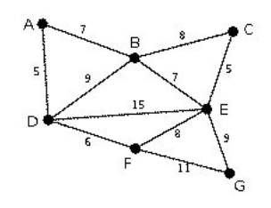

Kruskal algoritması bir örnek üzerinde detaylandırılacak olursa, yukarıdaki grafa
ait en az maliyetli kapsar ağacın bulunması için adım adım şunlar yapılmalıdır:

1) En düşük maliyet 5 değeriyle AD ve CE hatlarına ait. AD rastgele olarak seçilir.

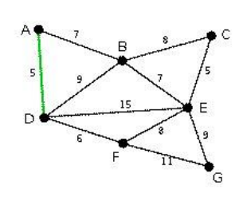

2) Hangi bir döngü oluşturmadığı için CE hattı da seçilir.

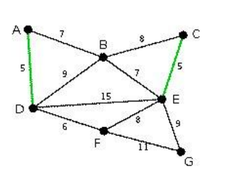

3) Bir sonraki en düşük maliyeti 6 değeri ile DF hattı oluşturuyor.

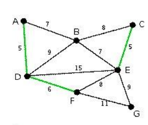

4) AB ve BE hatları 7 değeri ile en düşük maliyete sahip hatlar. AB kenarı
rastgele seçilerek ağaca ekleniyor.

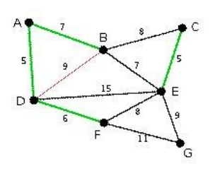

5) Hangi bir döngü oluşturmadığı için BE hattı da ağaca ekleniyor.

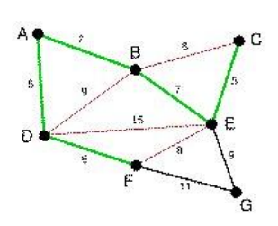

6) Kalan hatlardan BC, EF ve DB seçildiğinde döngü oluşacağı için bu hatlar seçim dışı bırakılıyor. Dolayısı ile kalan hatlardan (EG ve FG) daha düşük maliyetli olan EG hattı seçiliyor. Bu işlemin ardından bütün düğümler ağaca dahil olduğu için algoritma tamamlanıyor ve en az maliyetli kapsar ağaç bulunmuş oluyor. 39 değeri ile söz konusu ağaç, graftaki tüm düğümleri içeren alternatif ağaçlar arasındaki toplam maliyeti en düşük olanıdır

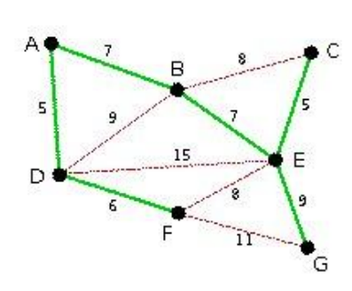

=== Örneğin

*Kruskal algoritması*

[source,c++]
----
#include<bits/stdc++.h>
#include <iostream>
using namespace std;
 
//Kruskal algoritması 
 
// integer çifti için pair typedef oluşturma
typedef pair<int, int> iPair;
 
//bir graf oluşturmak için struct
struct Graph
{
    int V, E;
    vector< pair<int, iPair> > edges;
 
    //constructor
    Graph(int V, int E)
    {
        this->V = V;
        this->E = E;
    }
 
    // grafa kenar eklemek için fonksiyon
    void kenarEkle(int u, int v, int w)
    {
        edges.push_back({w, {u, v}});
    }
 
    //kruskal'ın MST algoritmasını kullanarak mst'yi bulan fonksiyon
    int kruskalMST();
};
 
// Ayrık düğümleri gosteren fonksiyon
struct DisjointSets
{
    int *parent, *rnk;
    int n;
 
    //constructor
    DisjointSets(int n)
    {
        // bellek ayırma
        this->n = n;
        parent = new int[n+1];
        rnk = new int[n+1];
 
        //başlangıçta, tüm köşeler farklı düğümlerdir ve sıra 0'dır
        for (int i = 0; i <= n; i++)
        {
            rnk[i] = 0;
 
            //her oge kendi parent'tıdır
            parent[i] = i;
        }
    }
 
    // Find the parent of a node 'u'
    // Path Compression
    int find(int u)
    {
       //düğümlerin üst kısmını u--> parent[u] noktasından parent[u] noktasına getirir
        if (u != parent[u])
            parent[u] = find(parent[u]);
        return parent[u];
    }
 
    // Union by rank
    void merge(int x, int y)
    {
        x = find(x), y = find(y);
 
        //  küçük boy bir ağaç ile ağaç yapma
        if (rnk[x] > rnk[y])
            parent[y] = x;
        else // If rnk[x] <= rnk[y]
            parent[x] = y;
 
        if (rnk[x] == rnk[y])
            rnk[y]++;
    }
};
 
/* Fonksiyonların  mst'nin ağırlığını döndürür*/
int Graph::kruskalMST()
{
    int mst_wt = 0; // sonucu başlatır
 
    //kenarları maliyet bazında artan düzende sıralar
    sort(edges.begin(), edges.end());
 
    //ayrık kümeler oluşturma
    DisjointSets ds(V);
 
    // tüm sıralanmış kenarları yineleme
    vector< pair<int, iPair> >::iterator it;
    for (it=edges.begin(); it!=edges.end(); it++)
    {
        int u = it->second.first;
        int v = it->second.second;
 
        int set_u = ds.find(u);
        int set_v = ds.find(v);
 
        /*seçilen kenarın bir döngü oluşturup oluşturmadığını kontrol edir
          (U ve V aynı kümeye aitse döngü oluşturulur)*/
        if (set_u != set_v)
        {
            //mevcut kenar MST'DE olacak, bu yüzden yazdırır
            cout << u << " - " << v << endl;
 
            // MST ağırlığını günceller
            mst_wt += it->first;
 
            //iki seti birleştirir
            ds.merge(set_u, set_v);
        }
    }
 
    return mst_wt;
}
 
int main()
{
    //ağırlıklı ve tek yönlü graf oluşturma
    int V = 9, E = 14;
    Graph graf(V, E);
 
    // grafa kenarlar ekler
    graf.kenarEkle(0, 1, 4);
    graf.kenarEkle(0, 7, 8);
    graf.kenarEkle(1, 2, 8);
    graf.kenarEkle(1, 7, 11);
    graf.kenarEkle(2, 3, 7);
    graf.kenarEkle(2, 8, 2);
    graf.kenarEkle(2, 5, 4);
    graf.kenarEkle(3, 4, 9);
    graf.kenarEkle(3, 5, 14);
    graf.kenarEkle(4, 5, 10);
    graf.kenarEkle(5, 6, 2);
    graf.kenarEkle(6, 7, 1);
    graf.kenarEkle(6, 8, 6);
    graf.kenarEkle(7, 8, 7);
 
    cout << "MST kenarları\n";
    int mst_wt = graf.kruskalMST();
 
    cout << "\nMST ağırlığı= " << mst_wt;
 
    return 0;
}
----

Ekran Çıktısı:

 MST kenarları
 6 - 7
 2 - 8
 5 - 6
 0 - 1
 2 - 5
 2 - 3
 0 - 7
 3 - 4
 MST ağırlığı= 37

 

