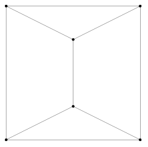
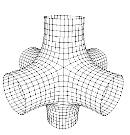
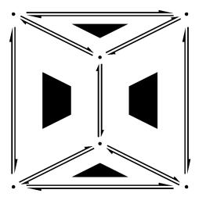
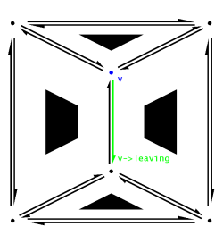
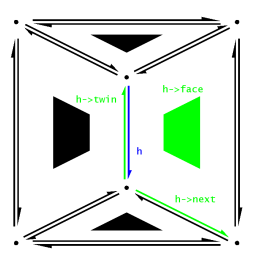
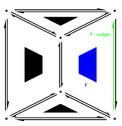
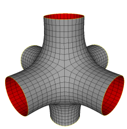
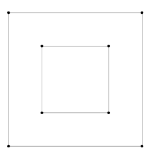
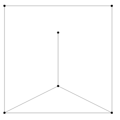
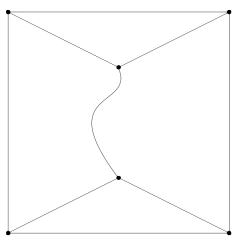

= Doubly Connected Edge List (DCEL)
:toc:

== DCEL Nedir?

Yarı kenarlı veri yapısı olarak da bilinen çift bağlantılı kenar listesi (DCEL), düzlemsel bir grafiğin düzleme ve politopların 3D'ye gömülmesini temsil eden bir veri yapısıdır.
Bu veri yapısı, söz konusu nesnelerle (köşeler, kenarlar, yüzler) ilişkili topolojik bilgilerin etkili bir şekilde değiştirilmesini sağlar.
Genellikle düzlemsel düz çizgi grafikleri (PSLG) olarak adlandırılan düzlemin çokgen alt bölümlerini işlemek için birçok hesaplama geometrisi algoritmasında kullanılır.
Örneğin, bir Voronoi diyagramı genellikle sınırlayıcı bir kutunun içindeki bir DCEL ile temsil edilir.

Bu sayfada yer alan metinler [[http://www.holmes3d.net/graphics/dcel/|buradan]] alıntılanıp düzenlenmiş çevirileri içerir.

DCEL, Çift Bağlantılı Kenar Listesi anlamına gelir. DCEL, 2B yüzey hakkında topolojik bilgilerin verimli bir şekilde depolanması için bir veri yapısıdır (3B alanda bulunur). Bu şekilde temsil edilen yüzeyler genellikle düzlemsel altbölümlere eşdeğer kabul edilir, ancak her uygulama mutlaka gerçek bir düzlemsel altbölümü depolayamayabilir.

Söz konusu yüzey yüzlerden (çokgenler), kenarlardan (iki bitişik yüz arasındaki sınırlar) ve köşelerden (iki bitişik kenar arasındaki sınırlar) oluşur. Kenarların yalnızca köşelerde temas etmesine izin verilir, bu da kenarların asla birbirini geçmediği anlamına gelir. 2B'de bu, düzlemin bir 'alt bölümüdür': düzlem kenarlara göre parçalara ayrılır ve bu parçaların her biri bir yüzdür.

3B alanda bulunan yüzeyle ilgileneceğiz. 3D'ye geçtiğimizde hala bir 2D yüzeyimiz var, artık 2D düzleminde yatmakla sınırlı değil. Yüzeyimiz hala manifold olmakla sınırlıdır. Bu, her kenarın 2B yüzeyinde iki yüzü ayırdığı bir kenar gibi olduğu anlamına gelir (Asla aynı kenarı paylaşan üç veya daha fazla yüzünüz olamaz). Ayrıca, yüzümüzü yönlendirilebilir olacak şekilde kısıtlayacağız, yani her yüzün bir iç ve bir dış tarafı vardır (2B düzlemin üstünden veya altından bakmaya eşdeğer) ve tüm komşu yüzlerin tutarlı iç ve dış kısımları vardır. Bu yüzey türü, 3D grafik kullanıcılarının çoğuna çokgen örgüler olarak aşinadır. (Ya da her yüzü üçgene üçgen üçgen örgü olarak sınırlarsak).

Bir DCEL veri yapısı, çokgen bir ağı, uzun çokgen listelerinde arama yapmadan köşelerin, kenarların veya yüzlerin komşularını bulmanın kolay olacağı şekilde tarif etmemizi sağlar. Göreceğimiz gibi bu hızlı erişim çok faydalı.

DCEL veri yapısı, kenar kavramı etrafında, ancak biraz sezgisel olmayan bir şekilde merkezlenmiştir. Bir kenarı doğrudan temsil etmek yerine, her kenar iki 'yarım kenardan' oluşur. Bir kenarı oluşturan iki yarım kenarın birbirinin 'ikizleri' olduğu ve işaretçileri birbirine kaydettiği söylenir. Her yarım kenar bir işaretçiyi başlangıç ​​noktasında saklar, ancak hedef noktasında saklamaz. Belirli bir yarım kenar h'nin hedefi, h ikizinin başlangıç ​​işaretçisine bakarak bulunabilir. Bu örgütsel strateji, her yarım kenarın bir yönelime sahip olduğu ve bu yönelimin her zaman ikizinin yöneliminin tersi olduğu anlamına gelir.

Yarım kenarda bir yüze dokunan bir 'dış' ve ikizine dokunan bir 'iç' bulunur. Bunlardan hangisinin hangisi olduğunu seçmekte özgürüz, ancak sol taraf için 'dış' ı seçeceğiz, üst taraftan yönlendirilmiş yarım kenarı görüntüleyeceğiz (Daha sonra görülmesi için). Şimdi her yarım kenarın ona dokunan tek bir yüzü olduğunu görebiliyoruz. Yarım kenara bu yüze bir işaretçi saklayacağız.

İki Katına Bağlı Kenar Listesi adının biraz aldatıcı olduğunu ve çok açıklayıcı olmadığını unutmayın. Aynı veri yapısı bazen hepsi daha iyi adlar olan Halfedge, Half-Edge veya twin-edge veri yapısı olarak bilinir. Orijinal DCEL yapısı, yarım kenarlar yerine kenar başına iki köşe işaretçisi olan yönlendirilmiş kenarlar kullandı ve bu nedenle yararlı veya verimli değildi. Ancak temel fikir benzerdi ve daha verimli yapı orijinal ismi korudu.

== Nesneler

DCEL veri yapısı üç tür nesneden oluşur; Köşeler, yarım kenarlar ve yüzler. Bu nesneler öncelikle diğer DCEL nesnelerine 'işaretçilerden' oluşur. Bunlar, diğer nesnelerin bellek adreslerini içeren gerçek C / C ++ işaretçileri olabilir veya tanıtıcılar, dizi indeksleri veya diğer adresleme türleri olabilir. Temel kalite, sivri uçlu nesneye arama yapmadan doğrudan erişime izin vermesidir. Açıklama uğruna bu referans tipine atıfta bulunmak için işaretçi kelimesini ve belirli bir örneğin işaretçisine atıfta bulunmak için C ++ ok gösterimini kullanıyorum (örn. H-orijin HalfEdge h'nin başlangıç ​​göstergesidir).

Nesnelerin her birinin sabit boyutta olduğunu unutmayın. Üçgenler, dörtgenler ve genel çokgenlerden oluşan ağlar için bile, nesneler nesne başına aynı miktarda bilgi içerir.

=== Köşe Nesnesi
Bir Vertex nesnesi, HalfEdge nesnesine 'ayrılma' adlı tek bir DCEL işaretçisi içerir. Bu işaretçi, bu Vertex nesnesini başlangıç ​​noktası olan tek bir HalfEdge işaret eder. Birden fazla HalfEdges bu Vertex nesnesini başlangıç ​​noktası olarak içeriyorsa, bırakma işaretçisi isteğe bağlı olarak herhangi birine işaret edebilir.

=== Yarım Kenar(HalfEdge) Nesnesi

HalfEdge nesnesi, Vertex için 'origin' adında bir işaretçi, 'face' adında bir Yüze işaretçi ve biri 'twin' ve 'next' adında biri olmak üzere HalfEdges için iki işaretçi içerir. Kök, HalfEdge'in başladığı tepe noktasıdır. Yüz HalfEdge'in 'sol' tarafındaki yüzdür, ikiz işaretçi ise HalfEdge'in kenarını tamamlayan 'sağ' tarafındaki HalfEdge'i gösterir. 'Bir sonraki' işaretçi, yarı-başlangıçtan başlayan ve bir sonraki tepe noktasında h-yüzünde sona eren, sınırın tersi yönünde hareket eden HalfEdge'i gösterir. Bu işaretçi, başladığımız HalfEdge'e geri dönene kadar bir sonraki işaretçileri takip ederek bir çokgeni geçmemizi sağlar.

=== Face Nesnesi ===

Bir Face nesnesi, HalfEdge nesnesine 'edge' adlı tek bir DCEL işaretçisi içerir. Bu işaretçi, bu Face nesnesini yüzü olarak içeren tek bir HalfEdge öğesini işaret eder. Bu HalfEdge, Face nesnesinin sınır HalfEdges'lerinden herhangi biri olabilir.

== Framework (Çerçeve)

DCEL veri yapısı, Vertex, HalfEdge ve Face nesnelerinin, nesneler arasında 'doğru' işaretçilerden oluşan bir koleksiyondur. Minimal bir durumda bu yeterlidir. Bu koleksiyonlara üç fikir daha ekleyeceğiz.

** Iterators (Yineleyiciler) 

Bir DCEL veri yapısının birçok kullanımında, tüm Vertex, HalfEdge ve / veya Face nesnelerine bir işlem uygulamak isteyeceğiz. Bu nedenle, her bir ilgili türün her nesnesine bir kez ve sadece bir kez dokunmamıza izin verecek bazı yineleme yöntemine ihtiyacımız var. Pratikte bu, nesnelerin bir dizi, bağlantılı liste veya sıralı gezintiye izin veren başka bir tür yapıda olduğu anlamına gelir. Özel ihtiyacımıza bağlı olarak, bu yapının dinamik olması ve nesnelerin yerleştirilmesine ve silinmesine izin vermesi gerekebilir.

** Infinite Face 

Şimdiye kadar bir ağın sınırını tanımlamaktan kaçındık. Tüm kenarları her iki tarafta bir yüze sahip olarak tanımladık. Bununla birlikte, sezgisel olarak, bir sınırımız varsa, bir tarafında bir yüzü olan ve diğer tarafında hiçbir şey olmayan kenarlarımız olacaktır. Yapıyı tutarlı tutmak için özel bir 'sonsuz yüz' sunuyoruz; Yineleyiciler tarafından geçilmeyen ve karşılaştırma ve test için her zaman erişilebilir olan bir Face nesnesi. Bu yüz, tüm sınır kenarlarının 'dış' kısmındaki yüzdür. DCEL yapısının kullanım amacına bağlı olarak, bir kenar işaretçisi saklayabilir veya saklamayabilir, çünkü sonsuz yüzün kenarlarını geçmeye çalışmak anlamlı olmayabilir Örneğin, sağdaki resimde sonsuz yüz formunun kenarlarını Altı ayrı parça, her biri ağın her kolunun açıldığı bir zincir.

** Associated Data (İlişkili Veriler) 

Çoğu uygulama için, DCEL nesnelerimizin bir kısmı veya tamamı ile ilişkili başka bir tür veri isteyeceğiz. Bu veriler, nesneyle önbelleğe almak istediğimizi hesaplamak için yeterince karmaşık bir şey olabilir (örn. Bir yüzün normali veya bir tepe noktasının normali) veya yapıdaki bazı algoritmaların bir parçası olarak gerekli geçici veriler olabilir ( Örneğin, bir yüzeyi taşkın doldururken 'önceden ziyaret edilmiş' bir etiket). Büyük ölçüde söz konusu verilere bağlı olan ilişkili verileri işlemenin birçok yolu vardır. Örneğin, normaller o kadar yaygın olabilir ki, bunları yalnızca nesnelerimize veya temel nesnelerin alt sınıflarına ekleriz. Geçici veriler o kadar nadiren kullanılabilir ki, DCEL nesnelerini geçici verilerle ilişkilendirmek için ayrı bir karma tablo oluşturmanın değerli olduğunu düşünüyoruz. Genel olarak, D verisinin O verildiğinde bir DCEL nesnesi O ile ilişkili olduğunu söyleyeceğim, D'yi sabit zamanda bulabiliriz. Bunun, D verildiğinde O'yu bulabileceğimiz anlamına gelmediğini unutmayın, ancak gerekirse bu ilişkiyi de oluşturabiliriz.

== Gelişmiş Sorunlar

Yukarıdaki basit açıklama, DCEL yapıları için birçok önemli konuyu göze çarpmaktadır, çünkü sunulan yapı 3D grafiklerde amaçlarımız için yeterlidir. Aşağıdaki sorunlar özel gereksiniminiz için önemli olabilir, ancak 3D grafiklerde genellikle o kadar önemli değildir.

=== Convention Choices

Yukarıdaki sunumda tamamen keyfi olan birkaç seçenek vardır. Yarım kenarları başlangıç ​​noktalarına işaretçi olarak sunduk. Bir işaretçiyi hedef köşesine kolayca depolayabilir ve ikizin hedefini kullanarak kökenini bulabiliriz (Bu durumda köşelerde 'gelen' yarım kenarı saklamak isteyebileceğimizi unutmayın). Benzer şekilde, kenarların 'solunda' yüzlerimizin olmasına ve böylece çokgenlerin saat yönünün tersine hareket ettirilmesine karar verdik. Bunu tersine çevirebilir ve saat yönünde bir sipariş tanımlayabiliriz (Bu belki bir DirectX ortamında makul olabilir). Ayrıca yarım kenarlarda sadece bir 'sonraki' işaretçi saklıyoruz. Sınırın tamamını bulmak için çokgenleri 'geriye' geçmeye istekli olduğumuz sürece, 'önceki' imleci veya bir sonraki imleci yerine saklayabiliriz. 3D grafiklerde normalde çizeceğimiz sıraya göre hareket etmemiz gerekiyor, bu yüzden bir sonraki işaretçiyi seçtik. Grafik olmayan uygulamalar için seçim daha çok kişisel tercih meselesidir.

=== Holes

Sunulan yapı yüzlerde 'deliklere' izin vermez. Tamamen genel bir düzlemsel altbölümde, başka bir yüz içinde yüzen, bağlantısız bir 'ada' yüzüne izin verilebilir. Bu durumun üstesinden gelmek için yüzlerin iç yüzlere işaretçi (leri) bir şekilde saklaması gerekir (yüzlerin kendileri veya kenarlarındaki yarım kenarlar). Uygulamada bu tür bir ağ istenmeyen bir durumdur, çünkü doğrudan işlenmesi zor olan dışbükey olmayan bir polihedra oluşturur (donanım, daha fazla bilgi sağlanmadığı sürece, bunları üçgenlere dönüştürmek isteyecektir). Açıklamamızda sonsuz yüzün aslında 'deliklere' sahip olabileceğini unutmayın, çünkü ağımız birkaç bağlantısız sınır içerebilir. Yukarıda gördüğümüz gibi, algoritmalarımızda bu tür sınırlara özellikle izin vermiyorsak (ör. Ağımızda sadece bir bağlı sınır kenarına izin vermedikçe), sonraki işaretçileri takip ederek sonsuz yüzün tüm sınırını geçmemizi engeller.

=== Degenerate Edges

Yukarıdaki sunumda spesifik olan hiçbir şey bunu yasaklamasa da, belirli bir kenarın her iki tarafındaki iki yüzün aynı yüz olmadığı, yani her kenarın iki farklı yüz arasında yer aldığı genel bir varsayım vardır. 3D çokgen örgüler oluşturmak için, bunun kesinlikle böyle olduğunu kastediyoruz. Genel düzlemsel altbölüm için izole edilmiş kenarlara izin verilir, bu da karmaşık sınır sorularına yol açar. Örneğin, sağdaki şeklin iki yüzü vardır, bir üçgen ve bir yedi taraflı yüz.

=== Nonlinear Components

Yukarıdaki sunum, iki köşe arasındaki kenarın düz bir çizgi olduğunu varsayar, ancak alttaki yapıda bu koşulu gerektiren hiçbir şey yoktur. Örneğin, her yarım kenarda koordinatları depolayabilir ve h-orijin, h-koordinatlar, h-ikiz-koordinatlar, h-ikiz-orijinli kontrol noktaları ile kübik Bezier eğrisi olarak bir kenar tanımlayabiliriz. Benzer şekilde, yüzlerin mutlaka düzlemsel olması gerekmez. Alışılmış bir oluşturma durumunda düz kenarlara sahip olmak tercih edilir, fakat yine de, genel bir düzlemsel alt bölüm keyfi eğimli kenarları içerebilir.

http://www.holmes3d.net/graphics/dcel/

