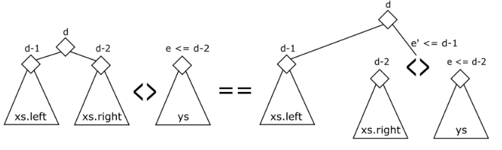

= Conc Tree List
:toc:

== Conc Tree List Nedir?

Conc-tree, veri yapısı, fonksiyonel task-parallel(görev-paralel) ve data-parallel(veri-paralel) programlama için özellikle uygundur ve benzer asimptotik karmaşıklığa sahip diğer veri yapılarına kıyasla uygulanması nispeten basittir. Conc-trees , sıralı soldan sağa yineleme sırası gerektirmeyen veri-paralel işlemlerin verimliliğini artırmak ve bu işlemlerde verilerin gereksiz kopyalarını önleyerek sabit faktörleri iyileştirmek için tasarlanmıştır. Dikey olarak, sonuç listesi veri soyutlamasının bir uygulaması olarak fonksiyonel tarzdaki görev paralel algoritmalarında verimli bir şekilde veri toplamak için kullanılırlar.  Conc-list, fonksiyonel cons-listelere paralel bir programlama karşılığıdır.

Fonksiyonel programlamada liste veri türünü hatırlayalım.

[source c++]
----
sealed trait List[+T] {
    def head: T
    def tail: List[T]
}

case class ::[T](head: T, tail: List[T]) extends List[T]

case object Nil extends List[Nothing] {
    def head = sys.error(”empty list”)
    def tail = sys.error(”empty list”)
}
----

Liste olarak kullanılan metodun implement işlemi:

[source c++]
----
def filter[T](list: List[T])(p: T => Boolean): List[T] = list match {
    case x :: xs if p(x) => x :: filter(xs)(p)
    case x :: xs => filter(xs)(p)
    case Nil => Nil
}
----

== Ağaçlar 

Listeler, yinelemeli yapıları nedeniyle sıralı hesaplamalar için oluşturulmuştur - soldan sağa doğru kaydırılırlar.

Ağaçlar paralel hesaplamalara izin verir - alt ağaçları paralel olarak geçebilir.

Örneğin;

[source c++]
----
sealed trait Tree[+T]

case class Node[T](left: Tree[T], right: Tree[T]) extends Tree[T]
case class Leaf[T](elem: T) extends Tree[T]
case object Empty extends Tree[Nothing]
----

T düğümü, sol ve sağ alt ağaca yalnızca iki referans içeren ancak somut öğeler içermeyen dahili düğümleri temsil edecektir. Bunun yerine elemanlar yaprak veri tipinde yer alacaktır. Elementlerin kendileri yaprakta bulunur ve yapraklar düğüm nesneleriyle birbirine bağlanır.

== Ağaçlarda Filtre

Ağaçlarda filtre metotlarını nasıl uygularız?

[source c++]
----
def filter[T](t: Tree[T])(p: T => Boolean): Tree[T] = t match {
    case Node(left, right) => Node(parallel(filter(left)(p), filter(right)(p)))
    case Leaf(elem) => if (p(elem)) t else Empty
    case Empty => Empty
}
----

Yüklemeli filtreyi filter(_%2 = 1) kullanarak tek elemanlar için filtrelediğimizi, şekil-1'deki ağaçta uyguladığımızı, sonra şekil 2'yi aldığımızı varsayalım. Boş düğümleri kaldırarak bunu şekil 3'e indirebiliriz. Ancak ne yazık ki bu ağaç, bir ağaçtan çok bir liste gibi olduğu için paralel hesaplamalar için uygun değildir.

conc-tree_list

**Bu nedenle, Ağaçlar dengelenmedikçe paralellik için iyi değildir.**

== Conc Veri Tipi

Bu nedenle, Ağaçlar dengelenmedikçe paralellik için iyi değildir.

Dengeli ağaçları temsil eden Conc adlı bir veri türü tasarlayalım:

[source c++]
----
sealed trait Conc[+T] {
    def level: Int          // ağacın yüksekliği
    def size: Int           // eleman sayısı
    def left: Conc[T]
    def right: Conc[T]
}
----

Paralel programlamada bu veri tipi **conc-list**  olarak bilinir.

Örneğin;

[source c++]
----
case object Empty extends Conc[Nothing] {
    def level = 0
    def size = 0
}

class Single[T](val x: T) extends Conc[T] {
    def level = 0
    def size = 1  
}

case class <>[T](left: Conc[T], right: Conc[T]) extends Conc[T] {
    val level = 1 + math.max(left.level, right.level)
    val size = left.size + right.size
}
----

**Ayrıca, ağacın dengeli olması için conc-trees için aşağıdaki özellikleri sağlaması gerekir:**

    * <> ise alt ağaçta düğüm bulunmaz.
    * Bir düğümün sol ve sağ alt ağacı arasındaki seviye farkı her zaman 1 veya daha azdır.

Örneğin;

[source c++]
----
def <>(that: Conc[T]): Conc[T] = {     // conc constructor
    if (this == Empty) that
    else if (that == Empty) this
    else concat(this, that)            // ağaç yeniden düzenlenir
----

== Conc Veri Türü ile Birleştirme

Birleştirmenin birkaç durumu dikkate alması gerekir.

İlk olarak, iki ağacın yükseklik farkı 1 veya daha az olabilir:

[source c++]
----
def concat[T](xs: Conc[T], ys: Conc[T]): Conc[T] = {
    val diff = ys.level - xs.level
    if (diff >= -1 && diff <= 1) new <>(xs, ys)
    else if (diff < -1) {
    //...
----

Aksi takdirde, sol ağacın sağdakinden daha yüksek olduğunu varsayalım.

*Durum-1:*

Sol ağaç sola yaslanmış.

Doğru alt ağacı özyinelemeli olarak birleştirin.

[source c++]
----
if (xs.left.level >= xs.right.level) {
val nr = concat(xs.right, ys)
new <>(xs.left, nr)
} else {
// ... devamı
----

*Durum-2:*

Sol ağaç sağa yaslanmış.

[source c++]
----
// ... yukarıdan devam
} else {
    val nrr = concat(xs.right.right, ys)
    if (nrr.level == xs.level - 3) {
        val nl = xs.left
        val nr = new <>(xs.right.left, nrr)
        new <>(nl, nr)
    } else {
        val nl = new <>(xs.left, xs.right.left)
        val nr = nrr
        new <>(nl, nr)
    }
}
----

Birleştirme O(h1 - h2) zamanını alır, burada h1 ve h2 iki ağacın yüksekliğidir.
