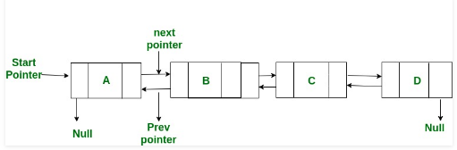

= XOR Linked List
:toc:

== XOR Linked List Nedir?

Normal bir Çift Bağlantılı Liste, önceki ve sonraki düğümlerin adreslerini depolamak için iki adres alanı için alan gerektirir. Çift Bağlantılı Liste'nin bellek açısından verimli bir sürümü, her düğümde adres alanı için yalnızca bir alan kullanılarak oluşturulabilir. Bu bellek verimli Çift Bağlantılı Liste XOR Bağlı Liste veya Bellek Verimli olarak adlandırılır, çünkü liste bir adres için yer kazanmak için bitsel XOR işlemini kullanır. XOR bağlantılı listesinde, gerçek bellek adreslerini depolamak yerine, her düğüm önceki ve sonraki düğümlerin XOR adreslerini saklar.

Yukarıdaki Çift Bağlantılı Listeyi düşünün. 

Aşağıda, Çift Bağlantılı Listesinin sıradan ve XOR (veya Bellek Verimli) gösterimleri yer almaktadır.

Node A:
prev = NULL, next = add(B) // önceki NULL ve sonraki B'nin adresi

Node B:
prev = add(A), next = add( C) // önceki A'nın adresi ve sonraki C
Node C:
prev = add(B), next = add(D) // önceki B'nin adresi ve sonraki D

Node D:
prev = add( C), next = NULL // önceki C'nin adresi ve sonraki NULL

XOR List
npx (sonraki ve önceki XOR) adres değişkenini çağıralım

Node A:
npx = 0 XOR add(B) // sıfır bit XOR ve B adresi

Node B:
npx = add(A) XOR add ( C) // A adresinin X adresi ve C adresi

Node C:
npx = add(B) XOR add(D) // B adresinin ve D adresinin bit XOR'u

Node D:
npx = add( C) XOR 0 // C ve 0 adresinin bit yönünde XOR

**XOR Aşağıdaki Özelliklere Sahiptir:**

 X ^ X = 0

 X ^ 0 = X

 X ^ Y=  Y ^ X

.XOR Bağlantılı Listesinde Geçiş:

XOR listesini hem ileri hem de geri yönde gezebiliriz. Listede gezinirken bir sonraki düğümün adresini hesaplamak için önceden erişilen düğümün adresini hatırlamamız gerekir. Örneğin, C düğümündeyken, B'nin add (B) 'nin XOR adresi olmalı ve C'nin npx değeri bize (D)' yi verir. Nedeni basit: npx ( C) “ekle (B) XOR ekle (D)”. Xp npx ( C) 'yi add (B) ile yaparsak sonucu “add (B) XOR add (D) XOR add (B)” olarak alırız, “add (D) XOR 0” olur ve “add (D)”. Yani bir sonraki düğümün adresi var. Benzer şekilde listeyi geriye doğru da çevirebiliriz.

Yukarıdaki özellikleri kullanarak XOR Bağlı Listeyi her iki yönde kolayca gezdirebiliriz.

== XOR Bağlı Listede Gezinme

1. Başlangıçta yeni bir düğüm ekleme fonksiyonu

2. Listeyi ileri yönde hareket ettiren fonksiyon

=== Örneğin;

**XOR linked list oluşturma**

Aşağıdaki kodda, insert() fonksiyonu başında yeni bir düğüm ekler. Sonraki ve önceki düğümlerin XOR'unu her düğümde saklıyoruz ve buna her düğümde sahip olduğumuz tek adres üyesi olan npx diyoruz. Başlangıçta yeni bir düğüm eklediğimizde, yeni düğümün npx değeri her zaman XULL ve NULL olur. Ve geçerli başlığın npx değeri, yeni başlığın ve yeni başlığın yanındaki düğümün XOR'u olarak değiştirilmelidir.

printList() fonksiyonu listeyi ileri yönde hareket ettirir . Her düğümden veri değerleri yazdırır. Listede gezinmek için, her noktada bir sonraki düğüme işaret etmeliyiz. Geçerli düğümü ve önceki düğümü izleyerek bir sonraki düğümün adresini alabiliriz. curr-> npx ve prev'den XOR yaparsak, bir sonraki düğümün adresini alırız.

[source,c++]
----
#include <bits/stdc++.h>
#include <inttypes.h>
using namespace std;

//XOR linked list oluşturma...

/*bellek verimli çift bağlantılı bir listenin
(memory efficient doubly linked list) düğüm yapısı*/
class Node
{
public:
    int data;
    Node* npx; //sonraki ve önceki düğümün XOR değeri
};

//düğüm adreslerinin XORed değerini döndürür
Node* XOR (Node *a, Node *b)
{
    return (Node*) ((uintptr_t) (a) ^ (uintptr_t) (b));
}

/*XORed bağlantılı listesinin başına bir düğüm ekler
 ve yeni eklenen düğümü head_ref olarak yapar*/
void insert(Node **head_ref, int data)
{
    //yeni düğüm için bellek ayırma
    Node *new_node = new Node();
    new_node->data = data;

    /* Yeni düğüm başlangıçta eklendiğinden, yeni düğümün
    npx değeri her zaman geçerli başlığın XOR ve NULL olur */
    new_node->npx = XOR(*head_ref, NULL);

    /* Bağlantılı liste boş değilse, geçerli baş düğümün npx değeri,
     yeni başlığın ve yeni başlığın yanındaki düğümün XOR değeri olacaktır. */
    if (*head_ref != NULL)
    {
        // *(head_ref)->npx  XOR, NULL ve next.
        //  XOR'u NULL ile yaparsak,
        Node* next = XOR((*head_ref)->npx, NULL);
        (*head_ref)->npx = XOR(new_node, next);
    }

    *head_ref = new_node;  // head_ref'i new_node olarak değiştirir
}

//çift bağlantılı listeyi ileri yönde yazdırır
void printList (Node *head)
{
    Node *curr = head;
    Node *prev = NULL;
    Node *next;

    cout << "XOR Linked List: \n";

    while (curr != NULL)
    {
        // current düğümünün datasını yazdırır
        cout<<curr->data<<" ";

        /*sonraki düğümün adresini al: curr-> npx next ^ prev, bu yüzden curr-> npx ^ prev olacak next ^ prev ^ prev sonraki olan*/
        next = XOR (prev, curr->npx);

        // sonraki yinelemeler için prev ve next değerlerini guncelle
        prev = curr;
        curr = next;
    }
}

int main ()
{
    /* çift bağlı liste oluşturulur
    head-->40<-->30<-->20<-->10 */
    Node *head = NULL;
    insert(&head, 10);
    insert(&head, 20);
    insert(&head, 30);
    insert(&head, 40);

    // oluşturulan listeyi yazdırılır
    printList (head);

    return (0);
}
----

Ekran Çıktısı:

 XOR Linked List: 
 40 30 20 10 

Örneğin;
**XOR linked list eleman ekleme**

[source,c++]
----
#include <iostream>
#include <vector>
#include <cstdint>
using namespace std;

// XOR bağlantılı listenin düğümü için veri yapısı
struct Node
{
	int data;
	Node* link;
};

//X ve y'nin XOR değerini döndürmek için fonksiyon
Node* XOR(Node *x, Node *y)
{
	return (Node*)((uintptr_t)(x) ^ (uintptr_t)(y));
}

// Listeyi ileri yönde hareket ettirmek için fonksiyon
void traverse(Node *head)
{
	Node *curr = head;
	Node *prev = nullptr;
	Node *next;

	while (curr != nullptr)
	{
		cout << curr->data << " -> ";

		// next düğüm, prev düğümün ve geçerli düğüm bağlantısının adresinden xor olur
		next = XOR(prev, curr->link);

		// döngünün bir next yinelemesi için prev ve curr işaretleyicilerini günceller
		prev = curr;
		curr = next;
	}

	cout << "nullptr";
}

//XOR bağlantılı listenin başına bir düğüm eklemek için fonksiyon
void push(Node* &headRef, int data)
{
	Node* newNode = new Node();//yeni bir liste düğümü oluşturur ve
	newNode->data = data;//düğümün verilerini atar

    /*yeni düğümün bağlantı alanı, başlangıçta yeni düğüm eklendiğinden
     geçerli başlığın XOR ve nullptr değeridir.*/
	newNode->link = XOR(headRef, nullptr);

	// bağlantılı liste boş değilse, geçerli headRef düğümünün değerini günceller
	if (headRef)
	{
       /* headRef-> link nullptr'in XOR ve bir sonraki düğümün adresidir
        Bir sonraki düğümün adresini almak için nullptr ile XOR*/
		headRef->link = XOR(newNode, XOR(headRef->link, nullptr));
	}

	// headRef işaretçisini günceller ve newNode düğüm değerini atar
	headRef = newNode;
}

int main()
{
	vector<int> keys = { 1, 2, 3, 4, 5 };//vector

	Node *head = nullptr;
	for (int i = keys.size() - 1; i >=0; i--)
		push(head, keys[i]);//listenin başına düğüm ekler

	traverse(head);//listeyi ileri yönde hareket ettirmeyi sağlar

	return 0;
}

----

Ekran Çıktısı:
 
 1 -> 2 -> 3 -> 4 -> 5 -> nullptr

**Faydalı Bağlantılar**

https://www.techiedelight.com/xor-linked-list-overview-implementation-c-cpp/#jhsdf

