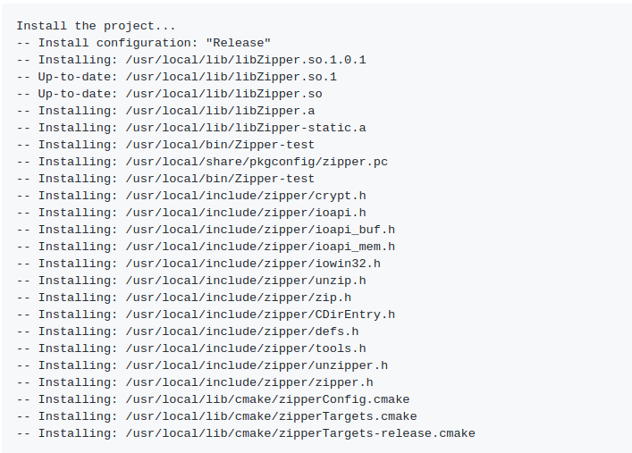

= Zipper
:toc:

Zipper'in amacı, minizip'in gücünü ve basitliğini daha nesneye yönelik/c ++ kullanıcı dostu bir kütüphaneye getirmektir. Güvenilir, basit ve esnek bir sıkıştırma kütüphanesinin gerekliliğinden doğmuştur. Esneklikle, her türlü girdi ve çıktıyı desteklemeyi kastediyorum, ancak yalnızca dosya sıkıştırmasıyla kısıtlanmak yerine özellikle belleğe sıkıştırabiliyor ve sadece dosyalar yerine bellekten veri kullanabiliyordum.

*Özellikler:*

   * Bellekte zip oluşturur.
   * Dosyaların, vektörlerin ve genel akışların zip olarak girdi olarak kullanılmasına izin verir.
   * Stratejileri değiştirmek için dosya eşlemeleri (varsa üzerine yaz veya eşlemeden alternatif ad kullanma)
   * Şifre korumalı zip
   * Çoklu platform

Zipper kullanmak ve derlemek için zlib kaynak dosyalarına sahip olmanız gerekir. Zipper' de minizip'e bağlıdır, ancak bir alt modül olarak kullanıldığından, repoyu klonlarken elde edersiniz ve proje ile derlenir.

*NOT:* Windows kullanıcıları için, zlib'in ZLIBROOT'ta bulunması gerekir.

== İndirme

[source bash]
----
sudo apt-get install zlib1g-dev  //ubuntu için
----

== Derleme 

Derleme çıktısı için bir klasör oluşturulmaktır.

[source bash]
----
git clone --recursive https://github.com/sebastiandev/zipper.git  # to get zipper and minizip submodule
cd zipper
mkdir build
cd build
cmake ../
make
----

== Kurulum

Derleme bölümünden sonra da derleme klasöründen şunu yazın:

[source bash]
----
sudo make install
----

Şuna benzer bir mesaj göreceksiniz:

== Kullanım

Zipper ve Unzipper olmak üzere iki sınıf bulunmaktadır. Yapıcılar ve depolama parametreleri için aynı şekilde davranırlar.

== Zipping

2 dosya ile bir zip dosyası oluşturma

[source c++]
----
using namespace zipper;

std::ifstream input1("some file");
std::ifstream input2("some file");

Zipper zipper("ziptest.zip");
zipper.add(input1, "Test1");
zipper.add(input2, "Test1");

zipper.close();
----

Bir zip'i isme ve tüm klasöre dosya ekleme:

[source c++]
----
Zipper zipper("ziptest.zip");
zipper.add("somefile.txt");
zipper.add("myFolder");
zipper.close();
----

Bir vektörü akış olarak kullanmamızı sağlayan boost'un akışlarını kullanarak bir zip dosyası oluşturma:

[source c++]
----
#include <boost\interprocess\streams\vectorstream.hpp>
...

boost::interprocess::basic_vectorstream<std::vector<char>> input_data(some_vector);

Zipper zipper("ziptest.zip");
zipper.add(input_data, "Test1");
zipper.close();
----

Dosyaları içeren bellek akışında bir zip oluşturma:

[source c++]
----
#include <boost\interprocess\streams\vectorstream.hpp>
...

boost::interprocess::basic_vectorstream<std::vector<char>> zip_in_memory;
std::ifstream input1("some file");

Zipper zipper(zip_in_memory);
zipper.add(input1, "Test1");
zipper.close();
----

Dosyaları olan bir vektörde zip oluşturma

[source c++]
----
std::vector<char> zip_vect;
std::ifstream input1("some file");

Zipper zipper(zip_vect);
zipper.add(input1, "Test1");
zipper.close();
----

== Unzipping

Tüm girişleri zip olarak alma

[source c++]
----
Unzipper unzipper("zipfile.zip");
std::vector<ZipEntry> entries = unzipper.entries();
unzipper.close();
----

Zip'ten tüm girişler çıkarılıyor

[source c++]
----
Unzipper unzipper("zipfile.zip");
unzipper.extract();
unzipper.close();
----

Diskteki mevcut dosyalar için alternatif adlar kullanarak zip'ten tüm girişleri çıkarma

[source c++]
----
std::map<std::string, std::string> alternativeNames = { {"Test1", "alternative_name_test1"} };
Unzipper unzipper("zipfile.zip");
unzipper.extract(".", alternativeNames);
unzipper.close();
----

Zip'ten tek bir giriş ayıklanıyor

[source c++]
----
Unzipper unzipper("zipfile.zip");
unzipper.extractEntry("entry name");
unzipper.close();
----

Zip'ten belleğe tek bir giriş ayıklama

[source c++]
----
std::vector<unsigned char> unzipped_entry;
Unzipper unzipper("zipfile.zip");
unzipper.extractEntryToMemory("entry name", unzipped_entry);
unzipper.close();
----

**NOT:** 
**extract, extractEntry, extractEntryToMemory** fonksiyonları **true/false** döndürür.

== Zipper 'i Projeye Bağlama

Aşağıdaki satırların projeye eklenmesi gerekir.

[source c++]
----
#include <zipper/unzipper.h>
#include <zipper/zipper.h>
----

