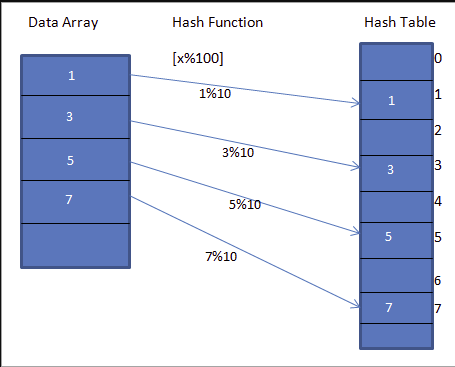
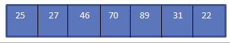
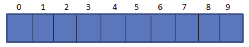
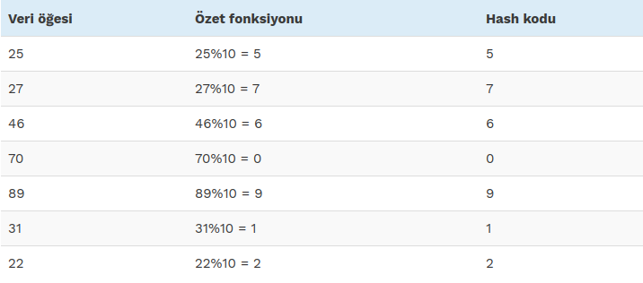
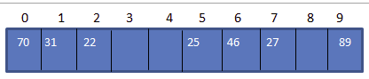
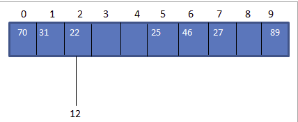
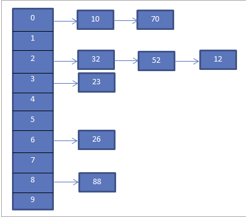
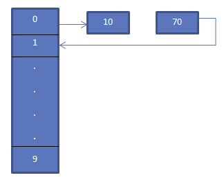
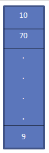
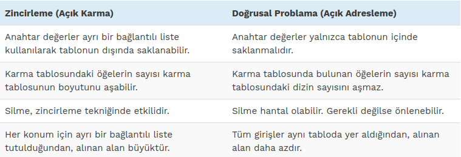

= Hash Tables (Karım Tablosu)
:toc:

== Hash Tables Nedir?

Hashing, "hash fonksiyonu" kullanarak büyük miktarda veriyi daha küçük bir tabloyla eşleştirebileceğimiz bir tekniktir.

Hashing tekniğini kullanarak, doğrusal ve ikili arama gibi diğer arama tekniklerine kıyasla verileri daha hızlı ve verimli bir şekilde arayabiliriz.

== C ++ ile Hashing

Binlerce kitap barındıran bir üniversite kütüphanesi örneğini ele alalım. Kitaplar konulara, bölümlere vb. konulara göre düzenlenmiştir. Ancak yine de her bölümde çok sayıda kitap bulunacak ve böylece kitap aramayı oldukça zorlaştıracaktır.

Bu nedenle, bu zorluğun üstesinden gelmek için her kitaba benzersiz bir sayı veya anahtar atarız, böylece kitabın yerini anında biliriz. Bu gerçekten de karma yoluyla elde edilir.

Kütüphane örneğimize devam ederek, her kitabı çok uzun bir dizeyle sonuçlanabilecek bölüm, konu, bölüm vb. temel alarak tanımlamak yerine, benzersiz bir işlev kullanarak kütüphanedeki her kitap için benzersiz bir tamsayı değeri veya anahtar hesaplıyoruz. Bu anahtarları ayrı bir tabloda saklayın.

Yukarıda belirtilen benzersiz fonksiyona *Karma Fonksiyonu* ve ayrı tabloya *Karma Tablosu* denir. Bir hash fonksiyonu, verilen değeri Hash Tablosundaki belirli bir benzersiz anahtara eşlemek için kullanılır. Bu, elemanlara daha hızlı erişim sağlar. Karma fonksiyonu ne kadar verimli olursa, her öğenin benzersiz tuşla eşlenmesi o kadar verimli olur.

Dizideki "x% 10" da "x" değerini eşleyen bir karma fonksiyonu olan h(x)'i ele alalım . Verilen veriler için, aşağıdaki şemada gösterildiği gibi anahtarlar veya Hash kodları veya Hashes içeren bir karma tablo oluşturabiliriz.

Yukarıdaki şemada, dizideki girdilerin bir karma fonksiyonu kullanılarak karma tablosundaki konumlarına eşlendiğini görebiliriz.

Dolayısıyla, karma işlemin aşağıda belirtilen iki adım kullanılarak yapıldığını söyleyebiliriz:

1) Değer, bir karma fonksiyonu kullanılarak benzersiz bir tamsayı anahtarına veya karmaya dönüştürülür. Karma tablosuna düşen orijinal öğeyi saklamak için bir dizin olarak kullanılır.

Yukarıdaki şemada, karma tablosundaki 1 değeri, şemanın LHS'sinde verilen veri dizisinden eleman 1'i depolamak için benzersiz anahtardır.

2) Veri dizisindeki eleman, karma anahtar kullanılarak hızlı bir şekilde alınabilen karma tablosunda saklanır. Yukarıdaki şemada, bir hash fonksiyonu kullanarak ilgili konumlarını hesapladıktan sonra hash tablosundaki tüm elemanları sakladığımızı gördük. Karma değerleri ve dizini almak için aşağıdaki ifadeleri kullanabiliriz.

[source,c++]
----
hash = hash_func(key)
index = hash % array_size
----

== Hash Function

Haritalamanın verimliliğinin kullandığımız hash fonksiyonunun verimliliğine bağlı olduğunu daha önce belirtmiştik.

Bir karma fonksiyonu temel olarak aşağıdaki gereksinimleri karşılamalıdır:

*Easy to Compute (Hesaplaması Kolay):* Bir hash fonksiyonu, benzersiz tuşları hesaplamak kolay olmalıdır.

*Less Collision (Daha Az Çarpışma):* Elemanlar aynı anahtar değerlere eşitlendiğinde, bir çarpışma meydana gelir. Kullanılan hash fonksiyonunda olabildiğince minimum çarpışma olmalıdır. Çarpışmalar meydana geleceğinden, çarpışmalarla ilgilenmek için uygun çarpışma çözümü tekniklerini kullanmalıyız.

*Uniform Distribution(Tekdüzen Dağıtım):* Hash fonksiyonu, verilerin karma tablosu boyunca düzgün bir şekilde dağılmasını sağlamalı ve böylece kümelemeyi önlemelidir.

== Hash Table C++

Karma tablo veya karma harita, işaretçileri orijinal veri dizisinin öğelerine depolayan bir veri yapısıdır.

Kütüphane örneğimizde, kütüphanenin karma tablosu kütüphanedeki kitapların her birine işaretçiler içerecektir.

Karma tablosundaki girişlere sahip olmak, dizideki belirli bir öğenin aranmasını kolaylaştırır.

Daha önce görüldüğü gibi, karma tablosu, dizini, istenen değerin bulunabileceği kova veya yuva dizisine hesaplamak için bir karma fonksiyonu kullanır.

*Aşağıdaki veri dizisine sahip başka bir örnek düşünün:*

*Aşağıda gösterildiği gibi 10 büyüklüğünde bir karma tablomuz olduğunu varsayın:*

*Şimdi aşağıda verilen hash fonksiyonunu kullanalım.*

[source,c++]
----
Hash_code = Key_value % size_of_hash_table
----

Bu, *Hash_code = Key_value%10*'a eşit olacaktır.

Yukarıdaki tabloyu kullanarak, hash tablosunu aşağıdaki gibi temsil edebiliriz.

*Bu nedenle, karma tablodan bir öğeye erişmemiz gerektiğinde, aramayı yapmak O(1) zaman alacaktır.*

== Çarpışma

Genellikle hash kodunu hash fonksiyonunu kullanarak hesaplar, böylece anahtar değerini hash tablosundaki hash koduyla eşleyebiliriz. Yukarıdaki veri dizisi örneğinde, 12 değerini girelim. Bu durumda, 12 anahtar değeri için hash_code 2 olacaktır.(12%10 = 2).

*Ancak karma tabloda, aşağıda gösterildiği gibi hash_code 2 için anahtar değeri 22'ye bir eşlememiz var:*

Yukarıda gösterildiği gibi, 12 ve 22 yani iki değer için aynı karma koduna sahibiz. Bir veya daha fazla anahtar değer aynı konuma eşit olduğunda, bir çarpışma ile sonuçlanır. Bu nedenle, karma kod konumu zaten bir anahtar değere sahiptir ve aynı konuma yerleştirilmesi gereken başka bir anahtar değer vardır.

Karma durumunda, çok büyük boyutlu bir karma tablonuz olsa bile, orada bir çarpışma olması gerekir. Bunun nedeni, genel olarak büyük bir anahtar için küçük bir benzersiz değer bulmamızdır, bu nedenle herhangi bir zamanda bir veya daha fazla değerin aynı karma koduna sahip olması tamamen mümkündür.

Çatışmada bir çarpışmanın kaçınılmaz olduğu düşünüldüğünde, daima çarpışmayı önlemenin veya çözmenin yollarını aramalıyız. Karma sırasında meydana gelen çarpışmayı gidermek için kullanabileceğimiz çeşitli çarpışma çözümü teknikleri vardır.

== Çarpışma Çözme Teknikleri

Aşağıdakiler, karma tablosundaki çarpışmayı çözmek için kullanabileceğimiz tekniklerdir.

=== 1-Ayrı Zincirleme (Açık Karma)

Bu en yaygın çarpışma çözümü tekniğidir. Bu aynı zamanda açık karma olarak da bilinir ve bağlantılı bir liste kullanılarak uygulanır.

Ayrı zincirleme tekniğinde, karma tablosundaki her girdi bağlantılı bir listedir. Anahtar karma koduyla eşleştiğinde, o özel karma koduna karşılık gelen bir listeye girilir. Böylece, iki anahtar aynı karma koduna sahip olduğunda, her iki giriş de bağlantılı listeye girilir.

*Yukarıdaki örnek için, Ayrı Zincirleme aşağıdaki gibi temsil edilmektedir.*

Yukarıdaki şema zincirlemeyi temsil eder. Burada mod (%) fonksiyonunu kullanıyoruz. İki anahtar değer aynı karma koduna eşit olduğunda, bu öğeleri bağlantılı bir liste kullanarak bu karma koduna bağladığımızı görürüz.

Anahtarlar karma tablosuna eşit olarak dağıtılmışsa, belirli bir anahtarın ortalama arama maliyeti, o bağlantılı listedeki ortalama anahtar sayısına bağlıdır. Bu nedenle, giriş sayısında yuvalardan daha fazla bir artış olsa bile ayrı zincirleme etkili olmaya devam eder.

Ayrı zincirleme için en kötü durum, tüm anahtarların aynı karma koduna eşit olması ve bu nedenle yalnızca bir bağlantılı listeye girilmesidir. Bu nedenle, karma tablodaki tüm girdileri ve tablodaki anahtar sayısı ile orantılı olan maliyeti aramamız gerekir.

=== 2-Doğrusal Problama (Açık Adresleme / Kapalı Karma)

Açık adresleme veya doğrusal problama tekniğinde, tüm giriş kayıtları hash tablosunda saklanır. Anahtar / değer çifti bir karma koduyla eşleştiğinde ve karma koduyla gösterilen konum boş olduğunda, anahtar değeri bu konuma eklenir.

Konum zaten dolu ise, bir problama dizisi kullanarak anahtar değeri, karma tablosunda bulunmayan bir sonraki konuma eklenir.

*Doğrusal problama için, karma fonksiyonu aşağıda gösterildiği gibi değişebilir:*

[source,c++]
----
hash = hash % hashTableSize
hash = (hash + 1) % hashTableSize
hash = (hash + 2) % hashTableSize
hash = (hash + 3) % hashTableSize
----

*Doğrusal problama durumunda, yarıklar veya ardışık problar arasındaki aralığın sabit olduğunu görüyoruz, yani 1.*

Yukarıdaki diyagramda, biz görüyoruz 0. konumda biz *hash = hash%hash_tableSize* karma fonksiyonu kullanılarak 10 girin.

Şimdi, eleman (70) ayrıca karma tablosundaki 0 ​​konumuna eşittir. Ancak bu yer zaten dolu. Dolayısıyla, doğrusal problama kullanarak 1 olan bir sonraki konumu bulacağız. Bu konum boş olduğundan, 70 tuşunu bir ok kullanarak gösterildiği gibi bu konuma yerleştiriyoruz.

*Ortaya çıkan Karma Tablo aşağıda gösterilmiştir.*

Doğrusal problama, sürekli hücrelerin işgal edilme ve yeni bir eleman ekleme olasılığının azaldığı “Birincil Kümeleme” sorunundan muzdarip olabilir.

Ayrıca, ilk eleman fonksiyonunda iki eleman aynı değeri alırsa, her iki eleman da aynı prob sırasını takip edecektir.

=== 3-İkinci dereceden sondalama (Quadratic Probing)

Quadratic problama doğrusal problama ile aynıdır, tek fark problama için kullanılan aralıktır. Adından da anlaşılacağı gibi, bu teknik, doğrusal mesafe yerine bir çarpışma meydana geldiğinde yuvaları işgal etmek için doğrusal olmayan veya karesel mesafeyi kullanır.

İkinci dereceden problamada, yarıklar arasındaki aralık, zaten karma dizine rastgele bir polinom değeri eklenerek hesaplanır. Bu teknik birincil kümelemeyi önemli ölçüde azaltır, ancak ikincil kümelemede gelişmez.

=== 4-Çift Karma (Double Hashing)

Çift karma tekniği doğrusal problamaya benzer. Çift karma ve doğrusal problama arasındaki tek fark, çift karma tekniğinde, problama için kullanılan aralığın iki karma fonksiyonu kullanılarak hesaplanmasıdır. Karma işlevini arka arkaya tuşa uyguladığımız için, birincil kümelemeyi ve ikincil kümelemeyi ortadan kaldırır.

*Zincirleme (Açık Karma) ve Doğrusal Problama (Açık Adresleme) Arasındaki Fark:*

=== Örneğin;

[source,c++]
----
#include<iostream>
#include<string>

using namespace std;

const int T_S = 200;//T_S: tablo boyutunu bildirir

class HashTableEntry {//Anahtar ve değer bildirmek için hashTableEntry sınıfı oluşturulur
public:
    int anahtar;
    int deger;
    HashTableEntry(int anahtar, int deger) { //constructor
        this->anahtar= anahtar;
        this->deger = deger;
    }
};

class HashMapTable {
private:
    HashTableEntry **hash;
public:
    HashMapTable() { //Tablo oluşturmak için hashMapTable yapıcısı oluşturulur
        hash = new HashTableEntry * [T_S];
        for (int i = 0; i< T_S; i++) {
            hash[i] = NULL;
        }
    }
    int hashFunc(int anahtar) {//T_S dönüş tipinde bir hashFunc() fonksiyonu oluşturulur
        return anahtar % T_S;
    }
    void insert(int anahtar, int deger) {//Bir anahtara değer eklemek için insert() fonksiyonu oluşturulur
        int h = hashFunc(anahtar);
        while (hash[h] != NULL && hash[h]->anahtar != anahtar) {
            h = hashFunc(h + 1);
        }
        if (hash[h] != NULL)
            delete hash[h];
        hash[h] = new HashTableEntry(anahtar, deger);
    }

    int searchKey(int anahtar) {// Bir anahtardaki değeri aramak için bir searchKey() fonksiyonu oluşturulur
        int h = hashFunc(anahtar);
        while (hash[h] != NULL && hash[h]->anahtar != anahtar) {
            h = hashFunc(h + 1);
        }
        if (hash[h] == NULL)
            return -1;
        else
            return hash[h]->deger;
    }
    void remove(int anahtar) {// Bir anahtardaki değeri silmek için remove() fonksiyonu oluşturulur
        int h = hashFunc(anahtar);
        while (hash[h] != NULL) {
            if (hash[h]->anahtar == anahtar)
                break;
            h = hashFunc(h + 1);
        }
        if (hash[h] == NULL) {
            cout<<"Değer Bulunamadı"<<anahtar<<endl;
            return;
        } else {
            delete hash[h];
        }
        cout<<"Değer Silindi"<<endl;
    }
    ~HashMapTable() {//Yapıcı tarafından oluşturulan nesneleri yok etmek için bir yıkıcı (~HashMapTable) çağırılır
        for (int i = 0; i < T_S; i++) {
            if (hash[i] != NULL)
                delete hash[i];
            delete[] hash;
        }
    }
};

int main() {
    HashMapTable hash;
    int deger,anahtar;
    int tercih;
    while (1) {
        cout<<"1.Tabloya Değer Ekle\n2.Tabloda Değer Ara\n3.Tablodan Değer Sil\n4.Çıkış\nTercih= ";
        cin>>tercih;
        switch(tercih) {
            case 1:
                cout<<"Eklenecek değeri girin: ";
                cin>>deger;
                cout<<"Eklenecek değerin anahtarını girin:";
                cin>>anahtar;
                hash.insert(anahtar, deger);//Anahtar ve değerler eklemek için insert() fonksiyonu çağırılır
                break;
            case 2:
                cout<<"Aranacak değerin anahtarını girin: ";
                cin>>anahtar;
                if (hash.searchKey(anahtar) == -1) {//aranan değer hash tablosunda yoksa
                    cout<<" "<<anahtar<<endl;
                    continue;
                } else {
                    cout<<"Anahtardaki değer: "<<anahtar<<" : ";
                    cout<<hash.searchKey(anahtar)<<endl;// Değeri aramak için searchKey() fonksiyonu çağırılır
                }
                break;
            case 3:
                cout<<"Silinecek değerin anahtarını girin: ";
                cin>>anahtar;
                hash.remove(anahtar);// anahtarı kaldırmak için remove() fonksiyonu çağırılır
                break;
            case 4:
                exit(1);
            default:
                cout<<"\nDoğru seçeneği girin!!\n";
        }
    }
    return 0;
}
----

Ekran Çıktısı:

 1.Tabloya Değer Ekle
 2.Tabloda Değer Ara
 3.Tablodan Değer Sil
 4.Çıkış
 Tercih= 1
 Eklenecek değeri girin: 20
 Eklenecek değerin anahtarını girin:1
 1.Tabloya Değer Ekle
 2.Tabloda Değer Ara
 3.Tablodan Değer Sil
 4.Çıkış
 Tercih= 1
 Eklenecek değeri girin: 30
 Eklenecek değerin anahtarını girin:2
 1.Tabloya Değer Ekle
 2.Tabloda Değer Ara
 3.Tablodan Değer Sil
 4.Çıkış
 Tercih= 2
 Aranacak değerin anahtarını girin: 1
 Anahtardaki değer: 1 : 20
 1.Tabloya Değer Ekle
 2.Tabloda Değer Ara
 3.Tablodan Değer Sil
 4.Çıkış
 Tercih= 3
 Silinecek değerin anahtarını girin: 2
 Değer Silindi
 1.Tabloya Değer Ekle
 2.Tabloda Değer Ara
 3.Tablodan Değer Sil
 4.Çıkış
 Tercih= 4
 Process finished with exit code 1

