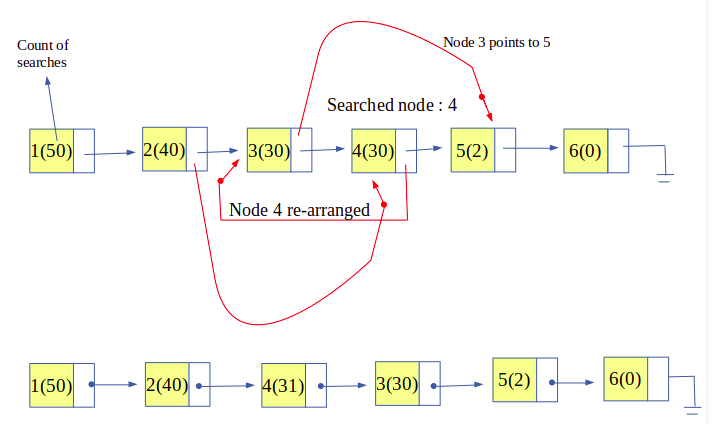
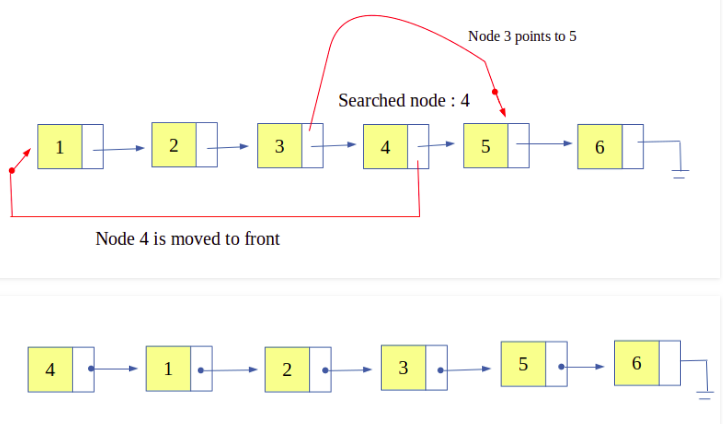

= Self-Organizing List
:toc:

== Self-Organizing List Nedir?

Sıralı bağlantılı liste için en kötü durum arama süresi O (n) 'dir. Dengeli İkili Arama Ağacı ile, kök ile yapılan bir karşılaştırmadan sonra düğümlerin neredeyse yarısını atlayabiliriz. Sıralanmış bir dizi için rastgele erişime sahibiz ve dizilere İkili Arama uygulayabiliriz.

Bağlantılı Listeler için aramayı daha hızlı hale getirmenin bir fikri Skip List'dir . İki olasılık olabilir. çevrimdışı (arama dizisinin tamamını önceden biliyoruz) ve çevrimiçi (arama dizisini bilmiyoruz).
Çevrimdışı olması durumunda, düğümleri azalan arama sıklıklarına göre koyabiliriz (Maksimum arama sayısına sahip öğe önce konur). Birçok pratik uygulama için önceden arama sırası elde etmek zor olabilir. Bir Self Organizing list   yapılan aramalara göre düğümlerini yeniden sıralar. 

== Self-Organizing List Tarafından Kullanılan Metotlar 

*1) Move-to-Front Method (Öne Taşı Yöntemi) :* Aranan herhangi bir düğüm öne taşınır. Bu stratejinin uygulanması kolaydır, ancak öğeyi her zaman öne taşıdığı için nadiren erişilen öğeleri fazla ödüllendirebilir.

*2) Count Method(Sayma Yöntemi) :* Her düğüm, kaç kez arama yapıldığını depolar. Düğüm sayısı azalarak sıralanır. Bu strateji, sayım depolamak için fazladan alan gerektirir.

*3) Transpose Method(Geçiş Yöntemi) :* Aranan herhangi bir düğüm, önceki düğüm ile değiştirilir. Öne taşı, bu yöntem değişen erişim modellerine hızlı bir şekilde uyum sağlamaz.

== Count Method(Sayma Yöntemi)

Self-Organizing List , daha iyi performans için kendini yeniden düzenleyen veya yeniden düzenleyen bir listedir. Basit bir listede, aranacak bir öğe, O (n) 'nin zaman karmaşıklığını veren sıralı bir şekilde aranır. Ancak gerçek senaryoda tüm öğeler sık ​​aranmaz ve çoğu zaman yalnızca birkaç öğe birden çok kez aranır.

Bu nedenle, kendi kendini düzenleyen bir liste, en sık kullanılan öğeleri listenin başına getiren bu özelliği (başvuru yeri olarak da bilinir) kullanır. Bu, öğeyi listenin başında bulma olasılığını artırır ve nadiren kullanılan öğeler listenin arkasına itilir.

**Count Method , her bir düğüm sayılır aranır süresi sayısını (yani arama sıklığı korunur). Bu nedenle, her düğüm arandığında artırılan her düğümle fazladan bir depolama ilişkilendirilir ve sonra düğümler, artan sayıma veya arama sıklığına göre düzenlenir. Bu, en sık erişilen düğümün listenin başında tutulmasını sağlar.**

=== Örneğin; Count Method 
 
[source,c++]
----
#include <iostream>
using namespace std;

//count yöntemi ile aranan düğümün sayısını arttırma

//self organizing list sınıfı
class self_list {
public:
    int value;
    int count;
    self_list* next;

    self_list(int value)//constructor
    {
        this->value = value;
        next = NULL;
    }
};

//head ve rear listenin başlangıcını ve sonunu gösterir.
self_list *head = NULL, *rear = NULL;

// eleman ekleme fonksiyonu
void insert_self_list(int number)
{
    //dugum olusturma
    self_list* temp = new self_list(number);

    //oluşturulan düğüme değer atama
    temp->value = number;
    temp->count = 0;
    temp->next = NULL;

    if (head == NULL)// listenin ilk elemanı ise
        head = rear = temp;

    else {//listenin geri kalan elemanları
        rear->next = temp;
        rear = temp;
    }
}

//fonksiyonu listesinde anahtar arama ve yeniden düzenlemek için self-organizing list
bool search_self_list(int key)
{
    self_list* current = head;//geçerli düğüme işaretçi atar

    self_list* prev = NULL;//önceki düğüme işaretçi atar

    // anahtar arama
    while (current != NULL) {

        if (current->value == key) {//anahtar bulunursa

            current->count = current->count + 1;//düğüm sayısını artırır

            if (current != head) {///eğer ilk eleman değilse
                self_list* temp = head;
                self_list* temp_prev = NULL;

                while (current->count < temp->count) {//aranan düğümü düzenlemek için yerini bulur
                    temp_prev = temp;
                    temp = temp->next;
                }

                // aranan düğümü düzenlemek için yer bulmak
                if (current != temp) {
                    prev->next = current->next;
                    current->next = temp;

                    if (temp == head)//eğer başlangıca yerleştirilecekse
                        head = current;
                    else
                        temp_prev->next = current;
                }
            }
            return true;
        }
        prev = current;
        current = current->next;
    }
    return false;
}

// listenin yazdırılması
void display()
{
    if (head == NULL) {
        cout << "List is empty" << endl;
        return;
    }

    // head'i gösteren geçici işaretçi
    self_list* temp = head;
    cout << "List: ";

    //sırayla düğümleri görüntüleme
    while (temp != NULL) {
        cout << temp->value << "(" << temp->count << ")";
        if (temp->next != NULL)
            cout << " --> ";

        // sonraki düğümleri gösteren işaretçi
        temp = temp->next;
    }
    cout << endl;
}

int main()
{
    /* listeye 5 tane eleman ekler */
    insert_self_list(1);
    insert_self_list(2);
    insert_self_list(3);
    insert_self_list(4);
    insert_self_list(5);

    //listeyi yazdırır
    display();

    search_self_list(4);
    search_self_list(2);
    display();

    search_self_list(4);
    search_self_list(4);
    search_self_list(5);
    display();

    search_self_list(5);
    search_self_list(2);
    search_self_list(2);
    search_self_list(2);
    display();
    return 0;
}
----

Ekran Çıktısı:
 
 List: 1(0) --> 2(0) --> 3(0) --> 4(0) --> 5(0)
 List: 2(1) --> 4(1) --> 1(0) --> 3(0) --> 5(0)
 List: 4(3) --> 5(1) --> 2(1) --> 1(0) --> 3(0)
 List: 2(4) --> 4(3) --> 5(2) --> 1(0) --> 3(0)

 
== Move to Front Method (Öne Taşıma Yöntemi)

Self-Organizing List , daha iyi performans için kendini yeniden düzenleyen veya yeniden düzenleyen bir listedir. Basit bir listede, aranacak bir öğe, O (n) 'nin zaman karmaşıklığını veren sıralı bir şekilde aranır. Ancak gerçek senaryoda tüm öğeler sık​aranmaz ve çoğu zaman yalnızca birkaç öğe birden çok kez aranır.

Bu nedenle, kendi kendini düzenleyen bir liste , en sık kullanılan öğeleri listenin başına getiren bu özelliği ( başvuru yeri olarak da bilinir) kullanır . Bu, öğeyi listenin başında bulma olasılığını artırır ve nadiren kullanılan öğeler listenin arkasına itilir.

**Move to Front Method, son zamanlarda aranan öğe listenin başına taşınır. Bu nedenle, bu yöntemin uygulanması oldukça kolaydır, ancak sık aranan öğeleri öne çıkarır. Sık aranan öğelerin öne doğru bu şekilde taşınması, erişim süresini etkilediği için bu yöntemin büyük bir dezavantajıdır.**

=== Örneğin; Move to Front Method 

[source,c++]
----
#include <iostream>
using namespace std;

//move to front yöntemi ile aranan düğümü başa alma

//self organizing list sınıfı
class self_list {
public:
    int value;
    self_list* next;

    self_list(int value)//constructor
    {
        this->value = value;
        next = NULL;
    }
};

//head ve rear listenin başlangıcını ve sonunu gösterir.
self_list *head = NULL, *rear = NULL;

// eleman ekleme fonksiyonu
void insert_self_list(int number)
{
    //dugum olusturma
    self_list* temp = new self_list(number);

    //oluşturulan düğüme değer atama
    temp->value = number;
    temp->next = NULL;

    if (head == NULL)// listenin ilk elemanı ise
        head = rear = temp;

    else {//listenin geri kalan elemanları
        rear->next = temp;
        rear = temp;
    }
}

//fonksiyonu listesinde anahtar arama ve yeniden düzenlemek için self-organizing list
bool search_self_list(int key)
{
    self_list* current = head;//geçerli düğüme işaretçi atar

    self_list* prev = NULL;//önceki düğüme işaretçi atar

    // anahtar arama
    while (current != NULL) {

        if (current->value == key) {//anahtar bulunursa

            if (prev != NULL) {//anahtar ilk öğe değilse

                /* elemanların yeniden düzenlenir*/
                prev->next = current->next;
                current->next = head;
                head = current;
            }
            return true;
        }
        prev = current;
        current = current->next;
    }

    //anahtar bulunamadı
    return false;
}

//listenin yazdırılması
void display()
{
    if (head == NULL) {
        cout << "List is empty" << endl;
        return;
    }

    // head'i gösteren geçici işaretçi
    self_list* temp = head;
    cout << "List: ";

    //sırayla düğümleri görüntüleme
    while (temp != NULL) {
        cout << temp->value;
        if (temp->next != NULL)
            cout << " --> ";

        // sonraki düğümleri gösteren işaretçi
        temp = temp->next;
    }
    cout << endl;
}

int main()
{
    /* listeye 5 tane eleman ekler */
    insert_self_list(1);
    insert_self_list(2);
    insert_self_list(3);
    insert_self_list(4);
    insert_self_list(5);

    // listeyi yazdırır
    display();

    // 4'ü arar ve bulunursa yeniden düzenler
    if (search_self_list(4))
        cout << "Searched: 4" << endl;
    else
        cout << "Not Found: 4" << endl;

    // listeyi yazdırır
    display();

    // 2'yi arar ve bulunursa yeniden düzenler
    if (search_self_list(2))
        cout << "Searched: 2" << endl;
    else
        cout << "Not Found: 2" << endl;
    display();

    return 0;
}
----

Ekran Çıktısı:

 List: 1 --> 2 --> 3 --> 4 --> 5
 Searched: 4
 List: 4 --> 1 --> 2 --> 3 --> 5
 Searched: 2
 List: 2 --> 4 --> 1 --> 3 --> 5

