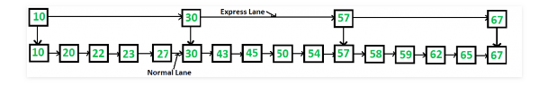
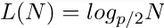

= Skip List
:toc:

== Skip List Nedir?

**Sıralı bağlantılı listede O (n) süresinden daha iyi arama yapabilir miyiz?**

Sıralı bağlantılı liste için en kötü durum arama süresi O (n) 'dir, çünkü listeyi yalnızca doğrusal olarak gezebiliriz ve arama yaparken düğümleri atlayamayız. Dengeli İkili Arama Ağacı için, kök ile yapılan bir karşılaştırmadan sonra düğümlerin neredeyse yarısını atlarız. Sıralanmış bir dizi için rastgele erişime sahibiz ve dizilere İkili Arama uygulayabiliriz.

Aramayı hızlandırmak için sıralı bağlantılı listeler ekleyebilir miyiz? CevapSkip List.
Fikir basit, birden fazla katman oluşturuyoruz, böylece bazı düğümleri atlayabiliyoruz. 16 düğümlü ve iki katmanlı aşağıdaki örnek listeye bakın. Üst katman yalnızca ana dış istasyonları bağlayan bir “ekspres şerit” olarak çalışır ve alt katman her istasyonu bağlayan bir “normal şerit” olarak çalışır. 50'yi aramak istediğimizi varsayalım, “ekspres şerit” in ilk düğümünden başlıyoruz ve bir sonraki düğümü 50'den büyük olan bir düğüm bulana kadar “ekspres şerit” üzerinde ilerlemeye devam ediyoruz. Böyle bir düğümü bulduktan sonra (30, aşağıdaki örnek) "ekspres şeritte", bu düğümdeki işaretçiyi kullanarak "normal şerit" e geçer ve doğrusal olarak "normal şeritte" 50 ararız. Aşağıdaki örnekte, “normal şeritte” 30'dan başlıyoruz ve doğrusal arama ile 50'yi buluyoruz.

**İki katmandaki zaman karmaşıklığı nedir?**

En kötü durum karmaşıklığı “ekspres şeritte” düğüm sayısı artı bir segmentteki düğüm sayısıdır (segment, “normal şerit” in iki “ekspres şerit” düğümü arasındaki “normal şerit” düğüm sayısıdır). Dolayısıyla, "normal şeritte" n düğümlerimiz, "ekspres şeritte" √n (n'nin kare kökü) düğümlerimiz varsa ve "normal şeritte" eşit olarak bölersek, "normal şeritte" nin her bölümünde √n düğümler olacaktır ”. √n aslında iki katmanla en uygun bölümdür. Bu düzenleme ile, bir arama için geçilen düğüm sayısı O (√n) olacaktır. Bu nedenle, O (√n) ekstra alan ile, zaman karmaşıklığını O (√n) olarak azaltabiliriz.

== Insertion (Ekleme)

**Düğüm seviyesine karar verme**

Listedeki her öğe bir düğüm ile temsil edilir, listeye eklenirken düğümün seviyesi rastgele seçilir. **Seviye, düğümdeki elemanların sayısına bağlı değildir.** Düğüm seviyesine aşağıdaki algoritma ile karar verilir.

[source,c++]
----
randomLevel()
lvl := 1
//random() [0...1) arası değer döndürür
while random() < p and lvl < MaxLevel do
lvl := lvl + 1
return lvl
----

MaxLevel , atlama listesindeki düzeylerin üst sınırıdır .  

olarak belirlenebilir. Yukarıdaki algoritma rastgele seviyenin asla MaxLevel'den daha yüksek olmayacağını garanti eder. Burada p , seviye i işaretçileri olan ve ayrıca seviye i + 1 işaretçileri olan düğümlerin kesiridir ve N, listedeki düğümlerin sayısıdır.

**Düğüm Yapısı**

Her düğüm, farklı seviyedeki düğümlere işaretçiler taşıyan bir anahtar ve bir ileri dizi taşır . Bir seviye i düğümü, 0'dan i'ye indekslenmiş i ileri işaretçileri taşır.

=== Örneğin

Skip list'e eleman ekleme...

[source,c++]
----
#include <bits/stdc++.h>
#include <iostream>

using namespace std;

//skip list'e eleman ekleme

//düğüm oluşturmak için sınıf
class Node
{
public:
    int key;

    //işaretçileri farklı düzeydeki düğüme tutmak için dizi
    Node **forward;
    Node(int, int);
};

Node::Node(int key, int level)
{
    this->key = key;

    //ileriye doğru bellek ayırma
    forward = new Node*[level+1];

    //diziyi 0 (NULL) ile doldur
    memset(forward, 0, sizeof(Node*)*(level+1));
};

class SkipList
{
    int MAXLVL; //Skip list için maksimum seviye
    float P;
    int level;//geçerli Skip list seviyesi

    Node *header;//header düğümü işaretçisi
public:
    SkipList(int, float);
    int randomLevel();
    Node* createNode(int, int);
    void insertElement(int);
    void displayList();
};

SkipList::SkipList(int MAXLVL, float P)
{
    this->MAXLVL = MAXLVL;
    this->P = P;
    level = 0;

    //header düğümü oluşturur ve anahtarı -1 olarak başlatır
    header = new Node(-1, MAXLVL);
};

//düğüm için rastgele seviye oluşturur
int SkipList::randomLevel()
{
    float r = (float)rand()/RAND_MAX;
    int lvl = 0;
    while (r < P && lvl < MAXLVL)
    {
        lvl++;
        r = (float)rand()/RAND_MAX;
    }
    return lvl;
};

//yeni düğüm oluşturur
Node* SkipList::createNode(int key, int level)
{
    Node *node = new Node(key, level);
    return node;
};

//verilen anahtarı SkipList'e ekler
void SkipList::insertElement(int key)
{
    Node *current = header;

    //güncelleme dizisi oluşturur ve başlatır
    Node *update[MAXLVL+1];
    memset(update, 0, sizeof(Node*)*(MAXLVL+1));

    /* en üst düzey atlama listesinden anahtar başlar , update dizisi aksi halde güncellenmiş update dizisi yanındaki düğümün
     anahtarından daha büyük iken geçerli işaretçiyi ileriye doğru hareket ettirir ve bir seviye aşağı doğru hareket
     ettirir ve aramaya devam eder
    */
    for (int i = level; i >= 0; i--)
    {
        while (current->forward[i] != NULL &&
               current->forward[i]->key < key)
            current = current->forward[i];
        update[i] = current;
    }

    /* anahtar eklemek için istenen pozisyon sağ seviye 0 ve ileri işaretçi ulaştı*/
    current = current->forward[0];

    /* current NULL ise, seviyenin sonuna ulaştığımız anlamına gelir veya current'in anahtarı eklemek için anahtara
     eşit değildir; bu, update[0] ve current node arasında düğüm eklememiz gerektiği anlamına gelir */
    if (current == NULL || current->key != key)
    {
        // düğüm için rastgele bir seviye oluşturma
        int rlevel = randomLevel();

        /*rasgele düzey listenin geçerli düzeyinden büyükse, daha fazla
         kullanım için üstbilgi işaretçisi ile güncelleme değerini başlatılır*/
        if (rlevel > level)
        {
            for (int i=level+1;i<rlevel+1;i++)
                update[i] = header;

            //liste current seviyesini güncelleme
            level = rlevel;
        }

        //rasgele seviye oluşturulmuş yeni düğüm oluştur
        Node* n = createNode(key, rlevel);

        //işaretçileri yeniden düzenleyerek düğümü ekler
        for (int i=0;i<=rlevel;i++)
        {
            n->forward[i] = update[i]->forward[i];
            update[i]->forward[i] = n;
        }
        cout << "Successfully Inserted key " << key << "\n";
    }
}

//listenin yazdırılması
void SkipList::displayList()
{
    cout<<"\n*****Skip List*****"<<"\n";
    for (int i=0;i<=level;i++)
    {
        Node *node = header->forward[i];
        cout << "Level " << i << ": ";
        while (node != NULL)
        {
            cout << node->key<<" ";
            node = node->forward[i];
        }
        cout << "\n";
    }
};

int main()
{
    srand((unsigned)time(0));//program her çalıştığında farklı sayı üretmek için

    SkipList liste(3, 0.5);//SkipList sınıfına nesne oluşturma

    liste.insertElement(3);//listeye anahtarlar ekler
    liste.insertElement(6);
    liste.insertElement(7);
    liste.insertElement(9);
    liste.insertElement(12);
    liste.insertElement(19);
    liste.insertElement(17);
    liste.insertElement(26);
    liste.insertElement(21);
    liste.insertElement(25);

    liste.displayList();//listeyi yazdırır
}

----

Ekran Çıktısı:

 Successfully Inserted key 19
 Successfully Inserted key 17
 Successfully Inserted key 26
 Successfully Inserted key 21
 Successfully Inserted key 25
 *****Skip List*****
 Level 0: 3 6 7 9 12 17 19 21 25 26 
 Level 1: 6 9 12 17 
 Level 2: 17 

== Searching and Deletion

=== Örneğin

skip list'te elemanları arama ve silme

[source,c++]
----
#include <bits/stdc++.h>
using namespace std;

//skip list'te elemanları arama ve silme

//düğüm oluşturmak için sınıf
class Node
{
public:
    int key;

    //işaretçileri farklı düzeydeki düğüme tutmak için dizi
    Node **forward;
    Node(int, int);
};

Node::Node(int key, int level)
{
    this->key = key;

    //ileriye doğru bellek ayırma
    forward = new Node*[level+1];

    //diziyi 0 (NULL) ile doldur
    memset(forward, 0, sizeof(Node*)*(level+1));
};

class SkipList
{
    int MAXLVL;// //Skip list için maksimum seviye
    float P;
    int level;////geçerli Skip list seviyesi
    Node *header;//header düğümü işaretçisi

public:
    SkipList(int, float);
    int randomLevel();
    Node* createNode(int, int);
    void insertElement(int);
    void deleteElement(int);
    void searchElement(int);
    void displayList();
};

SkipList::SkipList(int MAXLVL, float P)
{
    this->MAXLVL = MAXLVL;
    this->P = P;
    level = 0;

    //header düğümü oluşturur ve anahtarı -1 olarak başlatır
    header = new Node(-1, MAXLVL);
};

//düğüm için rastgele seviye oluşturur
int SkipList::randomLevel()
{
    float r = (float)rand()/RAND_MAX;
    int lvl = 0;
    while(r < P && lvl < MAXLVL)
    {
        lvl++;
        r = (float)rand()/RAND_MAX;
    }
    return lvl;
};

//yeni düğüm oluşturur
Node* SkipList::createNode(int key, int level)
{
    Node *n = new Node(key, level);
    return n;
};

//verilen anahtarı SkipList'e ekler
void SkipList::insertElement(int key)
{
    Node *current = header;

    //güncelleme dizisi oluşturur ve başlatır
    Node *update[MAXLVL+1];
    memset(update, 0, sizeof(Node*)*(MAXLVL+1));

    /* en üst düzey atlama listesinden anahtar başlar , update dizisi aksi halde güncellenmiş update dizisi yanındaki düğümün
     anahtarından daha büyük iken geçerli işaretçiyi ileriye doğru hareket ettirir ve bir seviye aşağı doğru hareket
     ettirir ve aramaya devam eder
    */
    for (int i = level; i >= 0; i--)
    {
        while (current->forward[i] != NULL &&
               current->forward[i]->key < key)
            current = current->forward[i];
        update[i] = current;
    }

    /* anahtar eklemek için istenen pozisyon sağ seviye 0 ve ileri işaretçi ulaştı*/
    current = current->forward[0];

    /* current NULL ise, seviyenin sonuna ulaştığımız anlamına gelir veya current'in anahtarı eklemek için anahtara
     eşit değildir; bu, update[0] ve current node arasında düğüm eklememiz gerektiği anlamına gelir */
    if (current == NULL || current->key != key)
    {
        // düğüm için rastgele bir seviye oluşturma
        int rlevel = randomLevel();

        /*rasgele düzey listenin geçerli düzeyinden büyükse, daha fazla
         kullanım için üstbilgi işaretçisi ile güncelleme değerini başlatılır*/
        if (rlevel > level)
        {
            for (int i=level+1;i<rlevel+1;i++)
                update[i] = header;

            //liste current seviyesini güncelleme
            level = rlevel;
        }

        //rasgele seviye oluşturulmuş yeni düğüm oluştur
        Node* n = createNode(key, rlevel);

        //işaretçileri yeniden düzenleyerek düğümü ekler
        for (int i=0;i<=rlevel;i++)
        {
            n->forward[i] = update[i]->forward[i];
            update[i]->forward[i] = n;
        }
        cout << "Successfully Inserted key " << key << "\n";
    }
}

// elemanı SkipList'den silen fonksiyon
void SkipList::deleteElement(int key)
{
    Node *current = header;

    //update dizisi oluşturur ve başlatır
    Node *update[MAXLVL+1];
    memset(update, 0, sizeof(Node*)*(MAXLVL+1));

    /* en üst düzey atlama listesinden anahtar başlar , update dizisi aksi halde güncellenmiş update dizisi yanındaki düğümün
     anahtarından daha büyük iken geçerli işaretçiyi ileriye doğru hareket ettirir ve bir seviye aşağı doğru hareket
     ettirir ve aramaya devam eder
    */
    for(int i = level; i >= 0; i--)
    {
        while(current->forward[i] != NULL  &&
              current->forward[i]->key < key)
            current = current->forward[i];
        update[i] = current;
    }

    /*0 seviyesine ulaştı ve muhtemelen istenen düğümümüz olan sağa ileri işaretçi.*/
    current = current->forward[0];

    //geçerli düğüm hedef düğümse
    if(current != NULL and current->key == key)
    {
        /* en düşük seviyeden başlar ve hedef düğümü kaldırmak için tek bağlantılı listede yaptığımız gibi işaretçileri yeniden düzenlenir*/
        for(int i=0;i<=level;i++)
        {
            /* Seviye i'de, sonraki düğüm hedef düğüm değilse, döngüyü kırar, daha fazla seviyeye geçmeye gerek kalmaz */
            if(update[i]->forward[i] != current)
                break;

            update[i]->forward[i] = current->forward[i];
        }

        //elemanları olmayan seviyeleri kaldırır
        while(level>0 &&
              header->forward[level] == 0)
            level--;
         cout<<"Successfully deleted key "<<key<<"\n";
    }
};

//SkipList'ten eleman arama fonksiyonu
void SkipList::searchElement(int key)
{
    Node *current = header;

    /* en üst düzey atlama listesinden anahtar başlar , update dizisi aksi halde güncellenmiş update dizisi yanındaki düğümün
     anahtarından daha büyük iken geçerli işaretçiyi ileriye doğru hareket ettirir ve bir seviye aşağı doğru hareket
     ettirir ve aramaya devam eder
    */
    for(int i = level; i >= 0; i--)
    {
        while(current->forward[i] &&
               current->forward[i]->key < key)
            current = current->forward[i];

    }

    current = current->forward[0];

    //geçerli düğümün arama anahtarına eşit anahtarı varsa, hedef düğüm bulunur
    if(current and current->key == key)
        cout<<"Found key: "<<key<<"\n";
};

//listenin yazdırılması
void SkipList::displayList()
{
    cout<<"\n*****Skip List*****"<<"\n";
    for(int i=0;i<=level;i++)
    {
        Node *node = header->forward[i];
        cout<<"Level "<<i<<": ";
        while(node != NULL)
        {
            cout<<node->key<<" ";
            node = node->forward[i];
        }
        cout<<"\n";
    }
};

int main()
{
    srand((unsigned)time(0));//program her çalıştığında farklı sayı üretmek için

    SkipList liste(3, 0.5);//SkipList sınıfına nesne oluşturma

    liste.insertElement(3);//listeye elemanlar ekler
    liste.insertElement(6);
    liste.insertElement(7);
    liste.insertElement(9);
    liste.insertElement(12);
    liste.insertElement(19);
    liste.insertElement(17);
    liste.insertElement(26);
    liste.insertElement(21);
    liste.insertElement(25);
    liste.displayList();//listeyi yazdırır

    //düğüm 19'u arar
    liste.searchElement(19);

    //düğüm 19'u siler
    liste.deleteElement(19);

    liste.displayList();//listeyi yazdırır
}

----

Ekran Çıktısı:

 Successfully Inserted key 3
 Successfully Inserted key 6
 Successfully Inserted key 7
 Successfully Inserted key 9
 Successfully Inserted key 12
 Successfully Inserted key 19
 Successfully Inserted key 17
 Successfully Inserted key 26
 Successfully Inserted key 21
 Successfully Inserted key 25
 *****Skip List*****
 Level 0: 3 6 7 9 12 17 19 21 25 26 
 Level 1: 6 7 9 12 19 21 25 26 
 Level 2: 7 9 21 
 Found key: 19
 Successfully deleted key 19
  *****Skip List*****
 Level 0: 3 6 7 9 12 17 21 25 26 
 Level 1: 6 7 9 12 21 25 26 
 Level 2: 7 9 21 

