= AVL Ağacı (High Balanced Tree)
:toc:

AVL ağacı, sol ve sağ alt ağaçların yükseklikleri arasındaki farkın tüm düğümler için birden fazla olamayacağı, kendini dengeleyen bir İkili Arama Ağacıdır (Binary Search Tree-BST).

Ağacın dengelenmesi için, her bir düğümün dengeli faktörü -1 ile 1 arasında olmalıdır. Aksi takdirde, ağaç dengesiz hale gelecektir.

*Örnek bir AVL Ağacı aşağıda gösterilmiştir.*

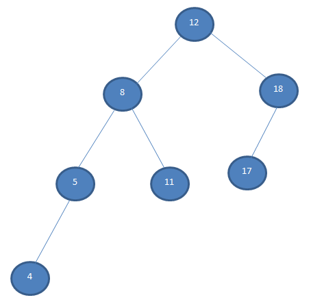

Yukarıdaki ağaçta, sol ve sağ alt ağaçların yüksekliklerindeki farkın 1 olduğunu fark edebiliriz. Bu, dengeli bir BST olduğu anlamına gelir. Dengeleme faktörü 1 olduğu için bu, sol alt ağacın sağ alt ağacın bir seviye daha yüksek olduğu anlamına gelir.

Dengeleme faktörü 0 ise, sol ve sağ alt ağaçların aynı seviyede olduğu anlamına gelir, yani eşit yükseklik içerirler. Dengeleme faktörü -1 ise, sol alt ağaç sağ alt ağaçtan bir seviye daha düşüktür.

AVL ağacı, ikili bir arama ağacının yüksekliğini kontrol eder ve eğrilmesini önler. Çünkü bir ikili ağaç eğri hale geldiğinde, tüm işlemler için en kötü durum (O (n)) olur. Denge faktörünü kullanarak, AVL ağacı ikili ağaç için bir sınır belirler ve böylece tüm işlemleri O'da tutar (log n).

== AVL Ağacı İşlemleri

AVL ağaçları tarafından desteklenen işlemler aşağıdadır.

=> *AVL Ağacına Düğüm Ekleme:* AVL ağacına düğüm ekleme işlemi, ikili arama ağacınınkiyle aynıdır. Tek fark, denge faktörünü korumak için, dengesiz hale gelmemesi için ağacı sola veya sağa döndürmemiz gerektiğidir.

=> *AVL Ağacından Düğüm Silme:* Silme işlemi, İkili arama ağacındaki silme işlemi ile aynı şekilde gerçekleştirilir. Yine bazı AVL Tree rotasyonları yaparak ağacı yeniden dengelememiz gerekir.

== AVL Ağacı Dengesizlik Durumları

=== Sol Sol Dengesizliği

Dengesizlik ağacın sol tarafındadır ve dallanma sola doğru gerçekleşmiştir.

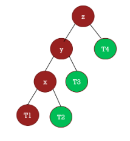

Yukarıdaki resme dikkat edin en tepedeki z düğümünün sağda sadece 1 adet çocuğu var (T4). Solda ise tam 3 tane. 3 – 1 = 2, yani aradaki fark 1’den büyük. (not yükseklik farkı hesap edilirken genelde kök düğümde sayılır bu durumda 4 – 2 = 2 olur, değişen bir şey olmaz).. Dengesizlik solun soluna doğru olduğu için sol – sol dengesizliği bulunmaktadır.

=== Sağ Sağ Dengesizliği

Sağ sağ dengesizliğinde, ikili arama ağacında dengesizlik sağa doğrudur ve sağa doğru dallanmıştır.

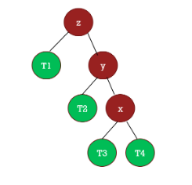

Yukarıdaki resimde de gördüğünüz üzere z düğümünün soluna ve sağına baktığımızda dengesizliği göreceksiniz. Soldaki yükseklik 2 iken (z dahil), sağdaki yükseklik ise 4’tür (z dahil) bu durumda 2 fark oluşmaktadır. Bu da dengesizliği doğurur.

=== Sol Sağ Durumu

Bu tip durumlar kafanızı karıştırabilir, karıştırmasın. Dengesizlik sola doğrudur, ancak dallanma sağa doğrudur. Aşağıda örneğimiz mevcut.

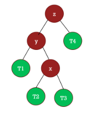

Resimde dikkat ettiyseniz ağaçta sol taraf daha derin, ancak y düğümünün sağa doğru derinleştiğini görüyoruz. Yani kök düğüme (z) göre sol taraf derin, ancak en derin düğüm (T3 ve T4) sağa doğru dallanmış. Bu yüzden Sol – Sağ dengesizliği adı veriyoruz. Eğer kafanız karıştıysa sol sol dengesizliğine tekrar bakın. Aradaki fark dallanmanın olduğu taraftır.

=== Sağ Sol Dengesizliği

Sağ sol dengesizliğinde dengesizlik sağa doğrudur, ancak sola doğru dallanma gerçekleşmiştir.

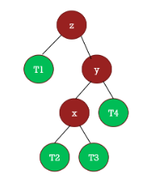

== AVL Ağacı Döndürme İşlemleri

AVL ağacı dengesizlik durumlarını döndürme işlemleri ile yaparız. Döndürmedeki temel hedefimiz dengesizliği çözmektir, esasında ise o ağacın yüksekliğini azaltmaktır. 

1. Sağa Döndürme İşlemi
2. Sola Döndürme İşlemi

Tüm dengesizlik durumlarını yukarıdaki iki işlemle rahatlıkla çözebiliriz. Şimdi AVL Ağacındaki dengesizlik durumlarını döndürme işlemleriyle nasıl çözüleceğini inceleyelim.

== AVL Ağacı Dengeleme İşlemleri

AVL Ağacında 4 temel dengesizlik durumu vardı. Bu 4 temel durumu yukarıdaki iki döndürme işlemini kullanarak dengeleyeceğiz.

=== AVL Ağacı Sol Sol Dengesizliği Çözümü

AVL ağaçlarında Sol Sol dengesizliğini sağa döndürerek çözeriz.

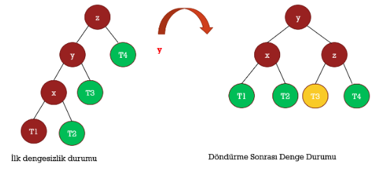

Yukarıdaki şekilde iki farklı ağaç var. İlk dengesizlik durumu konumundaki ağacın sol tarafının daha derin olduğunu, sol ve sağ taraf derinlikleri farkının da 1’den büyük olduğunu görüyoruz. (1 farkı tolere ediyoruz) O halde biz de z düğümünü sağa döndürüyoruz. Yani AVL Ağacı sağa döndürme işlemi yapıyoruz. Peki ne oluyor?

Y düğümü Z düğümünün yerine geçiyor. Doğal olarak da Z düğümü artık Y düğümünün çocuğu oluyor. Dikkat ederseniz T4 düğümü aynen Z ile taşınıyor. (döndürme sonrası denge durumu)

Dikkat ederseniz dengesizlik olan taraftaki tüm düğümlerin yüksekliği 1 azalıyor. X düğümü bir üste geliyor. Ancak kafanızı karıştıracak çok ama çok önemli bir ayrıntı var burada. Nedir terseniz Y düğümünün sağ çocuğu olan T3 düğümüne bir bakın. Normalde T3 düğümü Y’nin sağ çocuğu ancak dengele işleminden sonra artık Z düğümünün sol çocuğu olmuş. Peki ama neden?

Çünkü bu bir ikili arama ağacı. T3’ün Y’düğümünün sağında olma sebebi, Z düğümünden küçük, Y düğümünden büyük olması. (küçükler sola, büyükler sağa) Bu durumda T3 düğümü Z’den küçük olduğu için Z düğümünün soluna geliyor. T3 düğümünü ağaca yeniden ekliyormuşsunuz gibi düşünün. Kafa karıştıracak hiçbir durum yok.

=== AVL Ağacı Sağ Sağ Dengesizliği Çözümü

AVL Ağaçlarında Sağ Sağ dengesizliği olduğunda AVL Ağacı sola döndürme işlemi yapılır. Böylece ağaç dengeli bir hale gelir.

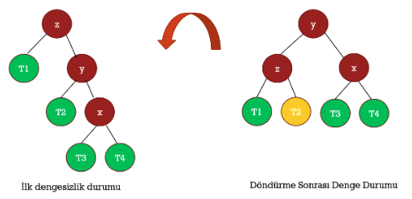

Yukarıdaki şekilde, soldaki ağaçta dengesizlik mevcut. Biz bu dengesizliği sola döndürerek çözeceğiz. Z düğümü sola döndürülür, y düğümü ise onun yerine geçer. X düğümü ise çocuklarıyla birlikte y düğümüne bağlı olduğundan aynen taşınır. T2 düğümü ise ağaca baştan ekleniyormuş gibi düşünülerek doğru konumuna eklenir.

=== AVL Ağacı Sol Sağ Dengesizliği Çözümü

Bu tip durumlarda iki ayrı döndürme yapılır. Dallanmanın olduğu kök düğüm sola döndürülerek sol – sol dengesizliği durumu elde ederiz. Daha sonra dengesizliğin olduğu ana kök düğüm sağa döndürülerek ağaç dengelenir.

*Sol-Sağ Dengesizlik Durumu İlk Adım*

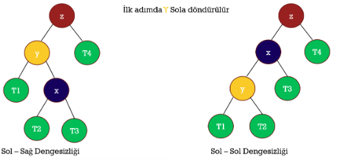

Soldaki dengesiz ağaca dikkatli bakın, sağa doğru dallanma y düğümünden itibaren başlamış, o halde y düğümü sola döndürülür. Neden? Çünkü sol sol dengesizliği elde edersek bunun çözümünün sağa döndürmek olduğunu biliyoruz. y düğümünü sola döndürünce x düğümü y düğümünün yerine geçiyor. Çocuklar aynen taşınıyor. Şimdi ise sağa döndürme gerçekleştireceğiz. Ama bu sefer z düğümünü kök kabul ederek sağa döndüreceğiz.

*Sol-Sağ Dengesizlik Durumu İkinci Adım*

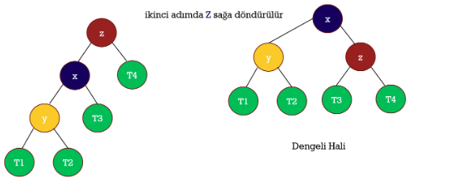

=== AVL Ağacı Sağ Sol Dengesizliği Çözümü

Bu durumda da çözüm iki aşamalıdır. Dallanmanın bağladığı kök düğüm sağa döndürülerek sağ – sağ dengesizliği olan bir ağaç elde edilir, daha sonra bu ağaç sola döndürülerek dengeleme gerçekleştirilir.

*Sol-Sağ Dengesizlik Durumu İlk Adım*

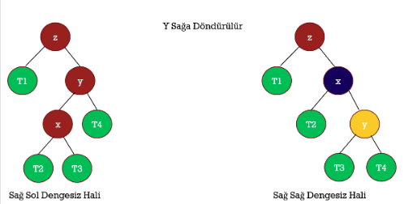

Yukarıdaki ağacın dengesiz halinde sağa doğru dengesizliğin olduğunu ancak sola doğru dallanmanın y düğümünden itibaren başladığını görebilirsiniz. İşte bu yüzden y düğümü sağa döndürülür. ve sağdaki, sağ – sağ dengesizliği olan ağaç elde edilir.

*Sol-Sağ Dengesizlik Durumu İkinci Adım*

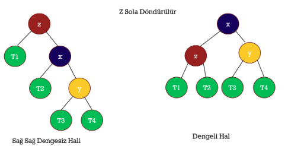

Sağ sağ dengesizliği olan ağaçlarda sola döndürme yaparak denge elde edildiğini biliyoruz artık. Dikkat edin z düğümünü sola döndürdük. böylece dengeli bir ağaç elde ettik.

== Örneğin

[source,c++]
----
#include<iostream>
using namespace std;
 
// AVL agacı sınıfı
class AVLNode
{
public:
    int key;
    AVLNode *left;
    AVLNode *right;
    int depth;
};
 
//iki sayıdan buyuk olanını bulan fonksiyon
int max(int a, int b){
    return (a > b)? a : b;
}
 
//ağacın yüksekliğini bulan fonksiyon
int depth(AVLNode *n)
{
    if (n == NULL)
        return 0;
    return n->depth;
}
//anahtar geçerek yeni bir düğüm ata
AVLNode* newNode(int key)
{
    AVLNode* node = new AVLNode();
    node->key = key;
    node->left = NULL;
    node->right = NULL;
    node->depth = 1; // new node added as leaf
    return(node);
}
// y düğümü eklenecek olan alt ağacı sağa döndür
AVLNode *rightRotate(AVLNode *y)
{
    AVLNode *x = y->left;
    AVLNode *T2 = x->right;
 
    // döndürme gerçekleştir
    x->right = y;
    y->left = T2;
 
    // yükseklik guncellenir
    y->depth = max(depth(y->left),
                   depth(y->right)) + 1;
    x->depth = max(depth(x->left),
                   depth(x->right)) + 1;
 
    // düğüm return edilir
    return x;
}
 
// x düğümü eklenecek olan alt ağacı sola döndür
AVLNode *leftRotate(AVLNode *x)
{
    AVLNode *y = x->right;
    AVLNode *T2 = y->left;
 
    // döndürme gerçekleştir
    y->left = x;
    x->right = T2;
    // yükseklik guncellenir
    x->depth = max(depth(x->left),
                   depth(x->right)) + 1;
    y->depth = max(depth(y->left),
                   depth(y->right)) + 1;
 
    // düğüm return edilir
    return y;
}
 
//N düğümünün denge faktörünü alınır
int getBalance(AVLNode *N)
{
    if (N == NULL)
        return 0;
    return depth(N->left) -
           depth(N->right);
}
//AVL ağacına düğüm ekleme işlemi
AVLNode* insert(AVLNode* node, int key)  {
    //normal BST rotasyonu
    if (node == NULL)
        return(newNode(key));
 
    if (key < node->key)
        node->left = insert(node->left, key);
    else if (key > node->key)
        node->right = insert(node->right, key);
    else //Eşit değerlere izin verilmiyor
        return node;
 
    //ata düğümünün yüksekliğini günceller
    node->depth = 1 + max(depth(node->left),  depth(node->right));
 
    int balance = getBalance(node);//denge faktörü
 
    // dengesizse döndür
 
    // sol-sol durumu
    if (balance > 1 && key < node->left->key)
        return rightRotate(node);
 
    // sağ-sağ durumu
    if (balance < -1 && key > node->right->key)
        return leftRotate(node);
 
    //sol-sağ durumu
    if (balance > 1 && key > node->left->key)
    {
        node->left = leftRotate(node->left);
        return rightRotate(node);
    }
 
    // sağ-sol durumu
    if (balance < -1 && key < node->right->key)
    {
        node->right = rightRotate(node->right);
        return leftRotate(node);
    }
    return node;
}
 
// minimum değere sahip düğümü bulan fonksiyon
AVLNode * minValueNode(AVLNode* node)
{
    AVLNode* current = node;
 
    // en soldaki yaprağı bulur
    while (current->left != NULL)
        current = current->left;
 
    return current;
}
//verilen anahtarla AVL ağacından bir düğümü silen fonksiyon
AVLNode* deleteNode(AVLNode* root, int key)
{
    if (root == NULL)
        return root;
 
    //BST silme işlemini gerçekleştirilir
    if ( key < root->key )
        root->left = deleteNode(root->left, key);
 
    else if( key > root->key )
        root->right = deleteNode(root->right, key);
 
    else
    {
        //sadece bir çocuğu olan ya da çocuğu olmayan düğüm
        if( (root->left == NULL) ||
            (root->right == NULL) )
        {
            AVLNode *temp = root->left ?
                            root->left :
                            root->right;
 
            if (temp == NULL)
            {
                temp = root;
                root = NULL;
            }
            else // düğümde bir çocuk varsa
                *root = *temp;
            free(temp);
        }
        else
        {
            AVLNode* temp = minValueNode(root->right);
 
            root->key = temp->key;
 
            // inorder siler
            root->right = deleteNode(root->right,
                                     temp->key);
        }
    }
 
    if (root == NULL)
        return root;
 
    //derinliği günceller
    root->depth = 1 + max(depth(root->left), depth(root->right));
 
 
    int balance = getBalance(root);//denge faktörü
 
    //dengesizse ağacı döndür
 
    //sol-sol durumu
    if (balance > 1 &&
        getBalance(root->left) >= 0)
        return rightRotate(root);
 
    //sol-sağ durumu
    if (balance > 1 &&  getBalance(root->left) < 0)  {
        root->left = leftRotate(root->left);
        return rightRotate(root);
    }
    //sağ-sağ durumu
    if (balance < -1 &&  getBalance(root->right) <= 0)
        return leftRotate(root);
 
    //sağ-sol durumu
    if (balance < -1 && getBalance(root->right) > 0)   {
        root->right = rightRotate(root->right);
        return leftRotate(root);
    }
    return root;
}
// AVL ağacını inorder yazdırır
void inOrder(AVLNode *root)
{
    if(root != NULL)
    {
        inOrder(root->left);
        cout << root->key << " ";
        inOrder(root->right);
    }
}
 
int main()
{
    AVLNode *root = NULL;
 
    // AVL ağacı oluşturur ve düğümler eklenir
    root = insert(root, 12);
    root = insert(root, 8);
    root = insert(root, 18);
    root = insert(root, 5);
    root = insert(root, 11);
    root = insert(root, 17);
    root = insert(root, 4);
 
    //Yukarıdaki ağaç için düzensiz geçiş: 4 5 8 11 12 17 18
    cout << "AVL ağacı: \n";
    inOrder(root);//inorder sıralayarak yazdırır
    root = deleteNode(root, 5);//5 numaralı düğümü siler
    cout << "\n5 numaralı düğüm silindikten sonra AVL ağacı: \n";
    inOrder(root);
 
    return 0;
}
----

Ekran Çıktısı:

 AVL ağacı: 
 4 5 8 11 12 17 18 
 5 numaralı düğüm silindikten sonra AVL ağacı: 
 4 8 11 12 17 18 

https://gist.github.com/harish-r/097688ac7f48bcbadfa5
 

