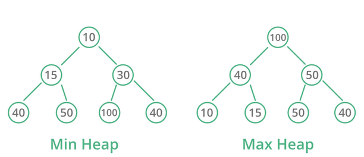
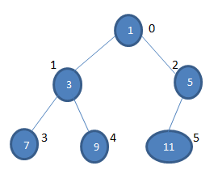
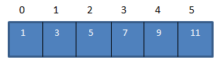

= Yığın Ağacı (Heap)
:toc:

== Yığın Ağacı Nedir?

Yığın, ağacın tam bir ikili ağaç olduğu özel bir ağaç tabanlı veri yapısıdır. Genellikle, yığınlar iki tip olabilir:

=> Max-Heap: Max-Heap'te kök düğüm, tüm çocuklarında bulunan düğümler arasında en büyük olmalıdır. Aynı özellik, o İkili Ağaçtaki tüm alt ağaçlar için yinelemeli olarak doğru olmalıdır.

=> Min-Heap: Min-Heap'te kök düğüm, tüm çocuklarında bulunan düğümler arasında minimum olmalıdır. Aynı özellik, o İkili Ağaçtaki tüm alt ağaçlar için yinelemeli olarak doğru olmalıdır.

== Binary Heap Nedir?

Binary Heap, yığın veri yapısının ortak uygulamasıdır.

Binary Heap aşağıdaki özelliklere sahiptir:

Muhtemelen son seviye hariç tüm seviyeler tamamen dolduğunda ve son seviyenin anahtarları mümkün olduğunca sol olduğunda tam bir ikili ağaçtır.
Binary Heap, Max-Heap veya Min-Heap olabilir.
İkili yığın tam bir ikili ağaçtır ve bu nedenle en iyi dizi olarak temsil edilebilir.

İkili yığın dizi olarak inceleyelim.

*Böylece, yukarıdaki ikili yığın dizisi aşağıda HeapArr dizisi olarak gösterilmiştir:*

HeapArr [i], Binary Heap'daki i. Düğümü ise, i. Düğümünden diğer düğümlerin dizinleri şunlardır:

1. **HeapArr [(i-1) / 2]** ⇒ Üst düğümü döndürür.

2. **HeapArr [(2 * i) +1]** ⇒ Sol alt düğümü döndürür.

3. **HeapArr [(2 * i) +2]** ⇒ Sağ alt düğümü döndürür.

== Örneğin

*Heap ağacında indekse göre düğüm silme...*

[source,c++]
----
#include<iostream>
#include<climits>
using namespace std;
 
//Heap agacında indekse gore düğüm silme
 
//agactaki düğümlerin yerlerini değiştirmek için oluşturulan fonksiyon
void swap(int *x, int *y)
{
    int temp = *x;
    *x = *y;
    *y = temp;
}
 
class Min_Heap
{
    int *heaparr; // agactaki elemanları tutmak için işaretci
    int capacity; // agacın kapasitesi
    int heap_size; // agacın boyutu
public:
    Min_Heap(int cap){
        heap_size = 0;
        capacity = cap;
        heaparr = new int[capacity];
 
    }
 
    // bir alt ağacı, belirli bir dizinde kök ile yığınlamak için
    void MinHeapify(int );
 
    int parent(int i) { return (i-1)/2; }
 
    //sol alt düğüm  i
    int left(int i) { return (2*i + 1); }
 
    //sag alt dugum i
    int right(int i) { return (2*i + 2); }
 
 
    int extractMin();  //yığının kökü
 
    // anahtar değerini i'de newKey'e düşür
    void decreaseKey(int i, int newKey);
 
    //agactaki min köku dondurur
    int getMin() { return heaparr[0]; }
 
    //i.dugumu siler
    void deleteKey(int i);
 
    //yeni dugum ekler
    void insertKey(int key);
    void displayHeap(){
        for(int i = 0;i<heap_size;i++)
            cout<<heaparr[i]<<" ";
 
        cout<<endl;
 
    }
};
 
//yeni bir dugum ekler
void Min_Heap::insertKey(int key)
{
    if (heap_size == capacity)  {
        cout << "\nAgacta Taşma\nDüğüm Eklenemedi\n";
        return;
    }
    // önce yeni dugumu sona ekler
    heap_size++;
    int i = heap_size - 1;
    heaparr[i] = key;
 
    while (i != 0 && heaparr[parent(i)] > heaparr[i])
    {
       swap(&heaparr[i], &heaparr[parent(i)]);//
       i = parent(i);
    }
}
 
void Min_Heap::decreaseKey(int i, int newKey) {
    heaparr[i] = newKey;
    while (i != 0 && heaparr[parent(i)] > heaparr[i])  {
       swap(&heaparr[i], &heaparr[parent(i)]);
       i = parent(i);
    }
}
  int Min_Heap::extractMin(){
    if (heap_size <= 0)
        return INT_MAX;
    if (heap_size == 1)   {
        heap_size--;
        return heaparr[0];
    }
    // Minimum dğümdeki değeri saklar, düğümden siler
    int root = heaparr[0];
    heaparr[0] = heaparr[heap_size-1];
    heap_size--;
    MinHeapify(0);
 
    return root;
}
 
void Min_Heap::deleteKey(int i)
{
    decreaseKey(i, INT_MIN);
    extractMin();
}
 
void Min_Heap::MinHeapify(int i)
{
    int l = left(i);
    int r = right(i);
    int min = i;
    if (l < heap_size && heaparr[l] < heaparr[i])
        min = l;
    if (r < heap_size && heaparr[r] < heaparr[min])
        min = r;
    if (min != i)
    {
        swap(&heaparr[i], &heaparr[min]);
        MinHeapify(min);
    }
}
 
int main()
{
    Min_Heap heap(11);//agacın kapasitesi constructor ile belirlenir
    heap.insertKey(2);//agaca dugumler ekelr
    heap.insertKey(4);
    heap.insertKey(6);
    heap.insertKey(8);
    heap.insertKey(10);
    heap.insertKey(12);
    cout<<"Düğüm eklendiktan sonra Head-Ağacı: ";
    heap.displayHeap();//
    cout<<"Agacın kök(root) elemanı: "<<heap.getMin()<<endl; //agactaki kök elemanını döndürür.
    heap.deleteKey(2);
    cout<<"Düğüm silindikten sonra Head-Ağacı: ";
    heap.displayHeap();
    cout <<"Agaçtaki minimum değerli düğüm: "<< heap.extractMin() <<endl;//Minimum düğümü agactan kaldırır.
    heap.decreaseKey(1, 1);
    cout <<"yeni kök:  "<< heap.getMin()<<endl; //agactaki kök elemanını döndürür.
 
    return 0;
}
----

Ekran Çıktısı:

 Düğüm eklendiktan sonra Head-Ağacı: 2 4 6 8 10 12 
 Agacın kök(root) elemanı: 2
 Düğüm silindikten sonra Head-Ağacı: 2 4 12 8 10 
 Agaçtaki minimum değerli düğüm: 2
 yeni kök:  1
 
== Örneğin

*Heap ağacına düğüm ekleme-düğüm silme*

[source,c++]
----
#include <iostream>
#include <vector>
using namespace std;
 
//Heap agacına dugum ekleme-dugum silme
class Heap{
public:
    void swap(int *, int *);
    void heapify(vector<int> &, int);
    void insert(vector<int> &, int);
    void deleteNode(vector<int> &, int);
    void printArray(vector<int> &);
};
 
void Heap::swap(int *a, int *b)//agactaki düğümlerin yerlerini değiştirmek için oluşturulan fonksiyon
{
  int temp = *b;
  *b = *a;
  *a = temp;
}
void Heap::heapify(vector<int> &heap, int i)//eklenen düğümün agaçta nerede duracağını belirleyen fonksiyon
{
  int size = heap.size();
  int largest = i;
  int l = 2 * i + 1;
  int r = 2 * i + 2;
  if (l < size && heap[l] > heap[largest])
    largest = l;
  if (r < size && heap[r] > heap[largest])
    largest = r;
 
  if (largest != i)
  {
    swap(&heap[i], &heap[largest]);
    heapify(heap, largest);
  }
}
void Heap::insert(vector<int> &heap, int newNum)//agaca yeni dugum ekler
{
  int size = heap.size();//vectorun boyutunu bulur
  if (size == 0)//boyut 0 ise direkt agaca ekler
  {
      heap.push_back(newNum);//vektorun sonuna yeni dugumu ekler
  }
  else//boyut 0'dan farklı ise
  {
      heap.push_back(newNum);//vektorun sonuna yeni dugumu ekler
    for (int i = size / 2 - 1; i >= 0; i--)
    {
      heapify(heap, i);//dugumun agactaki konumunu belirler
    }
  }
}
void Heap::deleteNode(vector<int> &heap, int num)
{
  int size = heap.size();//vectorun boyutunu bulur
  int i;
  for (i = 0; i < size; i++)
  {
    if (num == heap[i])//silinecek düğüm vektorun bir elemanı ise
      break;
  }
  swap(&heap[i], &heap[size - 1]);//vektorun elemanını en sona alır
 
  heap.pop_back();//vektorun sondaki elemanını siler
  for (int i = size / 2 - 1; i >= 0; i--)
  {
    heapify(heap, i);//agacı düzenler
  }
}
void Heap::printArray(vector<int> &heap)//agacı yazdıran fonksiyon
{
  for (int i = 0; i < heap.size(); ++i)
    cout << heap[i] << " ";
  cout << endl;
}
 
int main()
{
    Heap tree;
    vector<int> heapTree;//agactaki elemanları tutmak için vector
 
    tree.insert(heapTree, 3);//ağaca düğümler eklenir
    tree.insert(heapTree, 4);
    tree.insert(heapTree, 9);
    tree.insert(heapTree, 5);
    tree.insert(heapTree, 2);
 
    cout << "Max-Heap: ";//max heap agacı oluşturur
    tree.printArray(heapTree);
 
    tree.deleteNode(heapTree, 4);//agactan 4 numaralı dugumu siler
 
    cout << "Düğüm silindikten sonra:  ";
    tree.printArray(heapTree);//agaci tekrar yazdırır
}
----

Ekran Çıktısı:

 Max-Heap: 9 5 3 4 2 
 Düğüm silindikten sonra:  9 5 3 2

